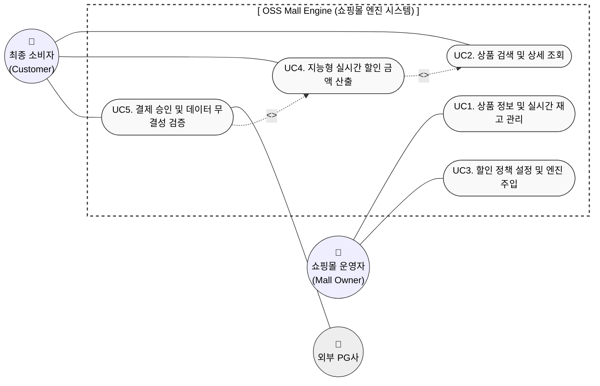
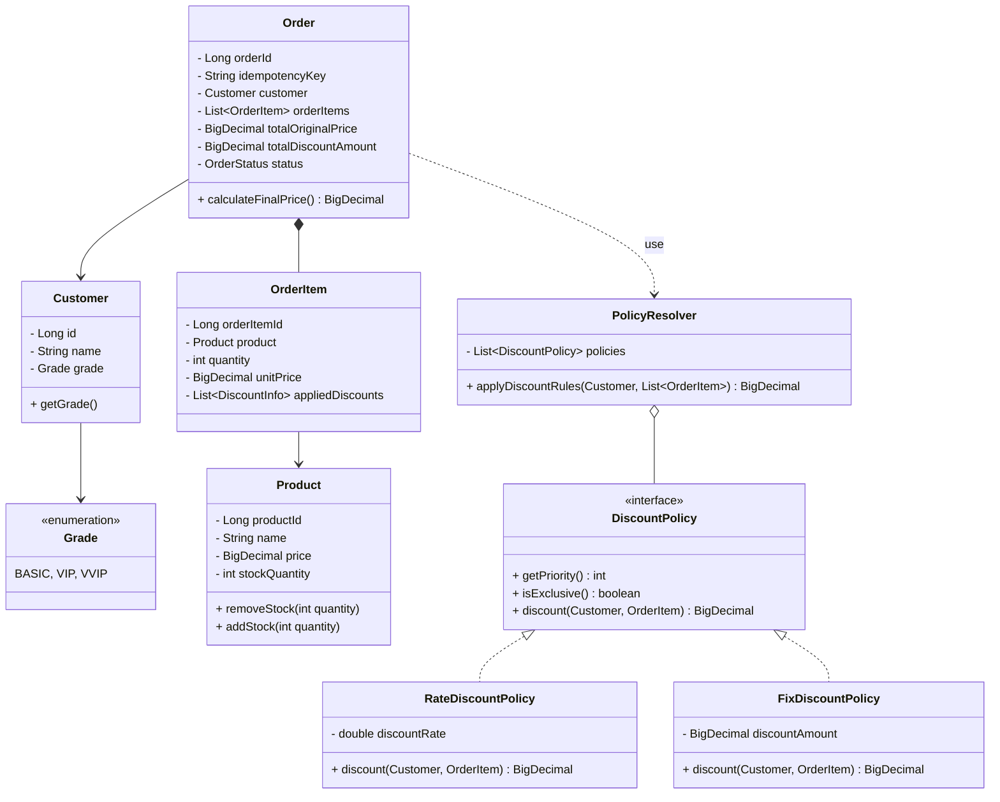
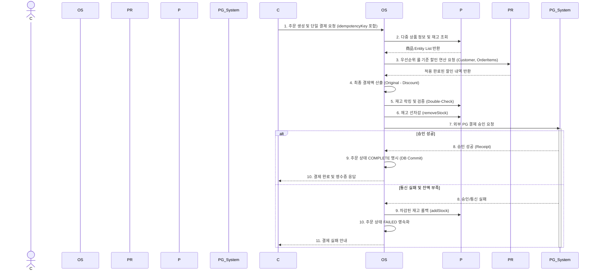

# [Analysis] 🛒 결제 및 할인 엔진 (Payment & Discount Engine)

| 항목 | 내용 |
| :--- | :--- |
| **Student No** | 22212025 |
| **Name** | 이진녕 |
| **E-mail** | vbnm963245@gmail.com |

**Project Title: OOP 원칙을 적용한 유연한 결제 및 할인 엔진 설계**

---

## [ Revision History ]

| Revision date | Version # | Description | Author |
| :--- | :--- | :--- | :--- |
| 2026/03/31 | 1.0.0 | First Draft 분석 문서 작성 | 이진녕 |

---

## = Contents =

1. [Introduction](#1-introduction)
2. [Use case analysis](#2-use-case-analysis)
3. [Domain analysis](#3-domain-analysis)
4. [Interaction Diagram (Sequence)](#4-interaction-diagram-sequence)
5. [Glossary](#5-glossary)
6. [References](#6-references)

---

## 1. Introduction

### 1) Executive Summary
본 시스템("오픈소스 몰 엔진")은 이커머스의 핵심인 **'데이터 파이프라인의 설계와 정책 최적화'**에 초점을 맞추어 기획되었다. 대형 플랫폼의 폐쇄적인 정책 알고리즘과 기존 오픈소스(Magento 등)의 과도한 복잡성을 해결하기 위해, 상품 관리부터 지능형 할인 계산 및 결제 무결성 검증에 이르는 핵심 기능만을 모듈화한 경량 시스템이다. RDBMS 기반의 정규화된 데이터 처리와 확장에 열린(OCP) 코어 엔진 설계가 주된 특징이다.

### 2) Business Goals
* **운영 유연성 확보:** 정책 엔진 설정을 통해 코드 수정 없이 우선순위 기반의 마케팅 전략(쿠폰, 등급 혜택 등)을 즉시 반영하여 운영 효율을 제고한다.
* **TCO(총 소유 비용) 절감:** 소규모 기업이나 개발자도 고성능 결제/할인 메커니즘을 쉽게 도입하여 백엔드 개발에 드는 시간과 유지보수 비용을 획기적으로 줄여준다.
* **오류 없는 결제:** 금융 사고 방지를 위해 BigDecimal을 사용한 정밀 연산과 재고 처리의 단일 DB 트랜잭션 정합성을 보장한다.

### 3) Technical Goals
* **의존성 주입(DI) & 전략 패턴:** 새로운 할인 정책 추가 시 핵심 도메인 로직 수정 없이 정책을 확장할 수 있는 유연한 아키텍처 구현.
* **정밀 연산(BigDecimal):** 부동소수점 오차를 방지하기 위해 BigDecimal 기반 정밀 연산을 사용하는 견고한 도메인 계층 설계.
* **동시성 및 데이터 안전성:** 비관적 락(Pessimistic Lock)과 낙관적 락(Optimistic Lock) 전략을 비교·적용하여 단일 DB 트랜잭션 내에서 재고 차감의 정합성을 확보한다.
* **성능 목표:** 병목 방지를 위해 외부 I/O 및 DB 트랜잭션을 제외한 할인 계산 로직 단독 기준 평균 200ms 이하의 처리 속도를 달성한다.

---

## 2. Use case analysis

### 2.1 Use Case Diagram

### 2.2 Use Case Specification

**UC1. 상품 정보 및 실시간 재고 관리**
* **Actor:** 쇼핑몰 운영자/개발자
* **Pre-condition:** 관리자로 시스템에 로그인되어 있어야 함.
* **Flow:** 
  1. 운영자가 상품 명세(가격, 정보)와 초기 재고를 입력 및 수정한다.
  2. 시스템이 DB에 ACID 트랜잭션으로 저장한다.
* **Post-condition:** 상품 정보와 재고가 DB에 영속화 됨.

**UC2. 상품 검색 및 상세 조회**
* **Actor:** 최종 소비자
* **Pre-condition:** 없음 (비회원/회원 모두 가능).
* **Flow:**
  1. 소비자가 상품 카테고리나 이름을 검색한다.
  2. 시스템은 상품 메타데이터와 현재 재고 상태를 가공하여 응답한다. (회원일 경우 UC4를 포함해 할인가격을 선 노출)

**UC3. 할인 정책 설정 및 엔진 주입**
* **Actor:** 쇼핑몰 운영자/개발자
* **Flow:**
  1. 운영자가 AppConfig 설정을 통해 룰(우선순위, Exclusive 플래그 등) 단위의 할인 정책 인터페이스를 교체/등록한다.
  2. 엔진이 컨테이너 초기화 시 또는 런타임에 동적으로 새 정책을 `Policy Resolver`에 연결하여 정해진 룰 기반(Rule-based) 환경을 구성한다.

**UC4. 지능형 실시간 할인 금액 산출**
* **Actor:** 최종 소비자, OSS Mall Engine
* **Flow:**
  1. 다중 상품(OrderItem) 결제를 요청할 때 소비자의 등급, 쿠폰, 현재 재고 상황을 획득한다.
  2. `Policy Resolver`가 설정된 우선순위와 배타적(exclusive) 플래그를 기준으로 룰 기반 할인을 적용하여 `BigDecimal`로 금액을 산출한다.
  3. 총 결제 금액을 반환한다.

**UC5. 결제 승인 및 데이터 무결성 검증**
* **Actor:** 최종 소비자, 외부 PG사
* **Pre-condition:** UC4를 통해 최종 결제액이 정확히 산출된 상태.
* **Flow:**
  1. 소비자가 인증을 거쳐 결제 요청을 전송.
  2. 엔진이 DB에서 잔여 재고를 즉시 락킹(Locking) 후 선차감 처리하고 외부 PG사에 승인 요청.
  3. PG사의 승인 응답 후 주문 데이터를 생성. (오류 시 선차감된 재고 롤백)
     *(💡 설계 의도: 재고 차감 시점은 데이터 일관성(Oversell 방지) vs 응답 성능(Lock 유지 시간)의 트레이드오프를 고려하여 선차감 방식을 선택함)*

---

## 3. Domain analysis

본 엔진은 객체지향의 다형성과 역할 분리를 강조합니다.

### 3.1 Domain Model (Class Diagram)

### 3.2 Domain Concepts Description
* **Customer & Grade:** 회원 정보를 표현하며 시스템 내 할인 정책의 중요한 판별 컨텍스트가 됩니다.
* **Product:** 상품 도메인 모델로 DB와 매핑되어 실제 재고 증감을 스스로 판별하고 관리하는 비즈니스 로직(응집도)을 갖습니다.
* **Order & OrderItem:** 클라이언트의 중복 결제를 방지하기 위한 식별자(`idempotencyKey`)를 포함하는 주문 엔티티입니다. **동일 `idempotencyKey` 요청 시 중복 처리 없이 기존 주문 결과를 반환**하여 안전성을 보장합니다. 여러 상품(`Product`)과 고유 수량, 적용된 할인 내역(`appliedDiscounts`)을 담아 관리하는 `OrderItem` 리스트를 구성해 현실적으로 확장하였습니다.
* **DiscountPolicy:** 핵심 전략 인터페이스입니다. 다형성을 제공하며 코드 단에 `getPriority()`를 명시해 우선순위 기반으로 규칙을 정의하고 단독 적용 여부(`exclusive flag`)를 가집니다.
* **PolicyResolver:** 복수의 DiscountPolicy를 주입받아 설정된 룰(우선순위, Exclusive 속성)에 기반해 순차적으로/일괄적으로 할인을 명확히 결합하는 실행 컴포넌트입니다.

---

## 4. Interaction Diagram (Sequence)

소비자가 상품 주문을 최종적으로 요청하고 결제가 승인되기까지의 객체 간 상호작용(Sequence) 흐름입니다.

---

## 5. Glossary

*   **Policy Resolver:** 우선순위 규칙과 exclusive flag에 입각해 여러 정책을 결합하고 할인을 부여하는 룰 실행 컴포넌트.
*   **BigDecimal:** 부동소수점 오차 발현을 방지하여 정교한 금액 계산을 책임지는 Java 타입.
*   **Idempotency (멱등성):** 동일 트랜잭션 식별자(`idempotencyKey`)로 재요청이 반복되더라도 결제 중복 및 데이터 꼬임 현상을 차단하여 시스템 일관성을 유지하는 개념.
*   **비관적 락(Pessimistic Lock):** 다중 요청 시나리오에서 데이터 조회 시점부터 DBMS 락을 획득하여 동시성에 따른 재고 초과 차감을 방어하는 기법.

---

## 6. References

1.  **Shopify Blog (2026):** "최고의 무료 오픈 소스 전자상거래 플랫폼 5가지"
2.  **Adobe Commerce (Magento) Developer Documentation**
3.  **Robert C. Martin:** "Clean Architecture" 및 "SOLID" 가이드
4.  **Spring Framework Reference Documentation:** DI 및 Transaction Management 참조.
