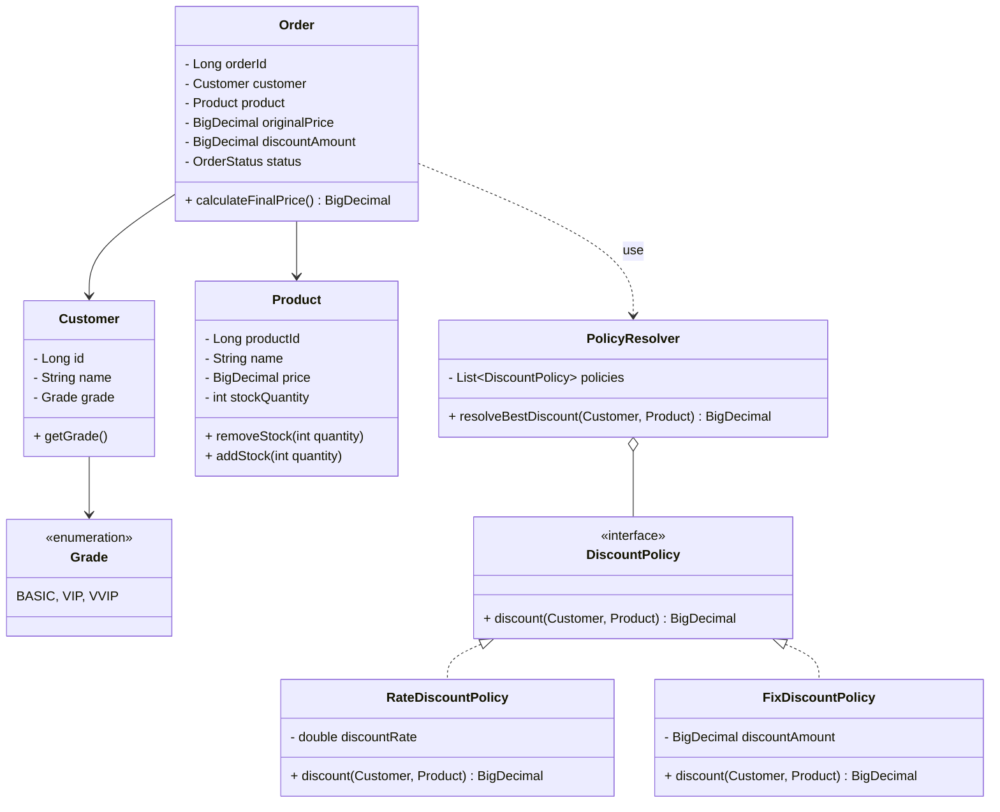
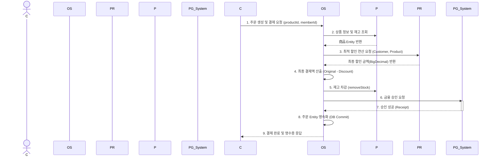

# [Analysis] 🛒 결제 및 할인 엔진 (Payment & Discount Engine)

| 항목 | 내용 |
| :--- | :--- |
| **Student No** | 22212025 |
| **Name** | 이진녕 |
| **E-mail** | vbnm963245@gmail.com |

**Project Title: OOP 원칙을 적용한 유연한 결제 및 할인 엔진 설계**

---

## [ Revision History ]

| Revision date | Version # | Description | Author |
| :--- | :--- | :--- | :--- |
| 2026/03/31 | 1.0.0 | First 분석 문서 작성 | 이진녕 |

---

## = Contents =

1. [Introduction](#1-introduction)
2. [Use case analysis](#2-use-case-analysis)
3. [Domain analysis](#3-domain-analysis)
4. [Interaction Diagram (Sequence)](#4-interaction-diagram-sequence)
5. [Glossary](#5-glossary)
6. [References](#6-references)

---

## 1. Introduction

### 1) Executive Summary
본 시스템("오픈소스 몰 엔진")은 이커머스의 핵심인 **'데이터 파이프라인의 설계와 정책 최적화'**에 초점을 맞추어 기획되었다. 대형 플랫폼의 폐쇄적인 정책 알고리즘과 기존 오픈소스(Magento 등)의 과도한 복잡성을 해결하기 위해, 상품 관리부터 지능형 할인 계산 및 결제 무결성 검증에 이르는 핵심 기능만을 모듈화한 경량 시스템이다. RDBMS 기반의 정규화된 데이터 처리와 확장에 열린(OCP) 코어 엔진 설계가 주된 특징이다.

### 2) Business Goals
* **운영 유연성 확보:** 정책 엔진 설정을 통해 코드 수정 없이 실시간 마케팅 전략(쿠폰, 등급 혜택, 타임세일)을 즉시 반영하여 운영 효율을 제고한다.
* **TCO(총 소유 비용) 절감:** 소규모 기업이나 개발자도 고성능 결제/할인 메커니즘을 쉽게 도입하여 백엔드 개발에 드는 시간과 유지보수 비용을 획기적으로 줄여준다.
* **오류 없는 결제:** 금융 사고 방지를 위해 부동 소수점 에러를 배제하는 정밀 연산과 결제/재고 트랜잭션의 ACID를 철저히 보장한다.

### 3) Technical Goals
* **의존성 주입(DI) & 전략 패턴:** 새로운 할인 정책 추가 시 기존 핵심 엔진의 소스코드를 0% 수정비율로 방어하는 확장 가능한 유연한 아키텍처 구현.
* **정밀 연산(BigDecimal):** 금액 계산에서 오차를 0%로 만들기 위한 견고한 도메인 계층 분리.
* **동시성 및 트랜잭션 안전성:** 데이터베이스 연동 시 발생하는 실시간 재고 차감 및 결제 승인의 무결성을 지키기 위해 격리 수준 제어 및 롤백 메커니즘을 완성한다.

---

## 2. Use case analysis

### 2.1 Use Case Diagram

```mermaid
usecaseDiagram
    actor "최종 소비자 (Customer)" as C
    actor "쇼핑몰 운영자 (Mall Owner)" as M
    actor "외부 PG사" as PG

    rectangle "OSS Mall Engine" {
        usecase "UC1. 상품 및 재고 관리" as UC1
        usecase "UC2. 상품 검색/조회" as UC2
        usecase "UC3. 할인 정책 주입" as UC3
        usecase "UC4. 지능형 할인 연산" as UC4
        usecase "UC5. 결제 및 무결성 검증" as UC5
    }

    C --> UC2
    C --> UC4
    C --> UC5
    
    M --> UC1
    M --> UC3
    
    UC5 --> PG : 결제 승인 요청
    UC4 .> UC2 : <<include>> (조회 시 할인금액 반영)
    UC5 .> UC4 : <<include>> (결제 시 최종금액 산출)
```

### 2.2 Use Case Specification

**UC1. 상품 정보 및 실시간 재고 관리**
* **Actor:** 쇼핑몰 운영자
* **Pre-condition:** 관리자로 시스템에 로그인되어 있어야 함.
* **Flow:** 
  1. 운영자가 상품 명세(가격, 정보)와 초기 재고를 입력 및 수정한다.
  2. 시스템이 DB에 ACID 트랜잭션으로 저장한다.
* **Post-condition:** 상품 정보와 재고가 DB에 영속화 됨.

**UC2. 상품 검색 및 상세 조회**
* **Actor:** 최종 소비자
* **Pre-condition:** 없음 (비회원/회원 모두 가능).
* **Flow:**
  1. 소비자가 상품 카테고리나 이름을 검색한다.
  2. 시스템은 상품 메타데이터와 현재 재고 상태를 가공하여 응답한다. (회원일 경우 UC4를 포함해 할인가격을 선 노출)

**UC3. 할인 정책 설정 및 엔진 주입**
* **Actor:** 쇼핑몰 운영자
* **Flow:**
  1. 운영자가 AppConfig 설정을 통해 특정 타겟팅 할인 정책 인터페이스(구현체)를 교체/등록한다.
  2. 엔진이 컨테이너 초기화 시 또는 런타임에 동적으로 새 정책을 `Policy Resolver`에 연결한다.

**UC4. 지능형 실시간 할인 금액 산출**
* **Actor:** 최종 소비자, OSS Mall Engine
* **Flow:**
  1. 상품 결제를 요청할 때 소비자의 등급, 쿠폰, 현재 재고 상황을 획득한다.
  2. `Policy Resolver`가 중첩된 할인 정책들의 충돌을 방지하고 최우선 혜택을 찾아 `BigDecimal` 기반으로 계산한다.
  3. 총 결제 금액을 반환한다.

**UC5. 결제 승인 및 데이터 무결성 검증**
* **Actor:** 최종 소비자, 외부 PG사
* **Pre-condition:** UC4를 통해 최종 결제액이 정확히 산출된 상태.
* **Flow:**
  1. 소비자가 인증을 거쳐 결제 요청을 전송.
  2. 엔진이 DB에서 잔여 재고를 즉시 락킹(Locking)/검증하고 외부 PG사에 승인 요청.
  3. PG사의 승인 응답 후 재고를 영구 차감하고 주문 데이터를 생성. (오류 시 전체 트랜잭션 롤백)

---

## 3. Domain analysis

본 엔진은 객체지향의 다형성과 역할 분리를 강조합니다.

### 3.1 Domain Model (Class Diagram)



### 3.2 Domain Concepts Description
* **Customer & Grade:** 회원 정보를 표현하며 시스템 내 할인 정책의 중요한 판별 컨텍스트가 됩니다.
* **Product:** 상품 도메인 모델. DB와 매핑되어 실제 재고 증감을 스스로 판별하고 관리하는 비즈니스 로직(응집도)을 갖습니다.
* **Order:** 생성된 주문 엔티티입니다. 소비자와 상품의 의존관계를 가지며 적용된 할인액을 기록합니다.
* **DiscountPolicy:** 핵심 전략 인터페이스입니다. 다형성을 통해 정액 할인(FixDiscountPolicy)과 정률 할인(RateDiscountPolicy)이 구현되며 확장에 열려 있습니다.
* **PolicyResolver:** 지능형 연산 모듈로, 복수의 DiscountPolicy를 주입받아 최적의 할인가를 도출합니다.

---

## 4. Interaction Diagram (Sequence)

소비자가 상품 주문을 최종적으로 요청하고 결제가 승인되기까지의 객체 간 상호작용(Sequence) 흐름입니다.



---

## 5. Glossary

*   **OSS (Open Source Software):** 누구나 자유롭게 사용, 변경할 수 있는 공개 소프트웨어.
*   **OCP (Open-Closed Principle):** 확장에는 열려 있어야 하고 코드 수정에는 닫혀 있어야 하는 객체지향 원칙.
*   **Policy Resolver:** 여러 할인 정책 중 최적의 결과를 선별하는 지능형 해석 컴포넌트.
*   **BigDecimal:** 금융, 화폐 등 오차 없는 정확한 십진연산을 위한 Java의 데이터 타입.
*   **DI (Dependency Injection):** 구현 객체를 내부에서 생성하지 않고 외부 구조(AppConfig)에서 주입해주어 결합도를 낮추는 기법.
*   **ACID 트랜잭션:** 데이터 무결성을 보장하기 위한 DB 트랜잭션의 4가지 주요 특성.

---

## 6. References

1.  **Shopify Blog (2026):** "최고의 무료 오픈 소스 전자상거래 플랫폼 5가지"
2.  **Adobe Commerce (Magento) Developer Documentation**
3.  **Robert C. Martin:** "Clean Architecture" 및 "SOLID" 가이드
4.  **Spring Framework Reference Documentation:** DI 및 Transaction Management 참조.
