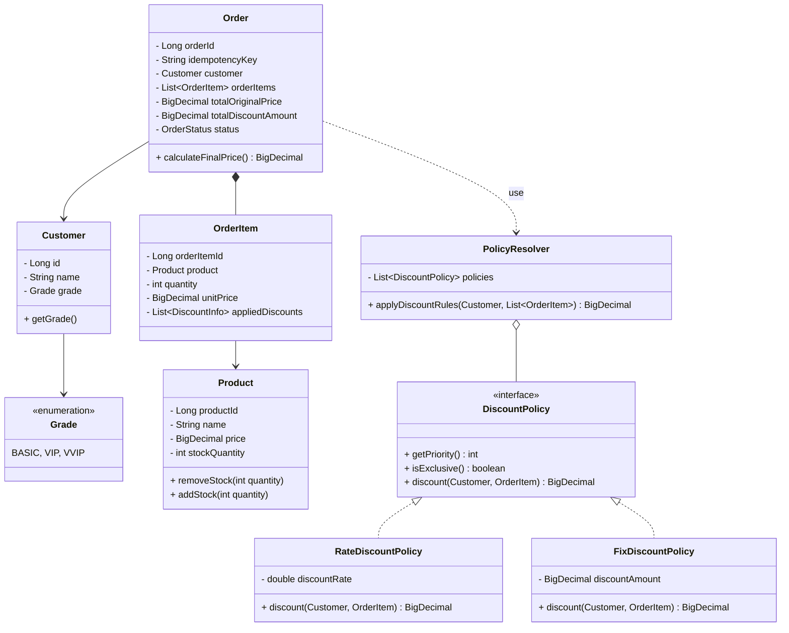
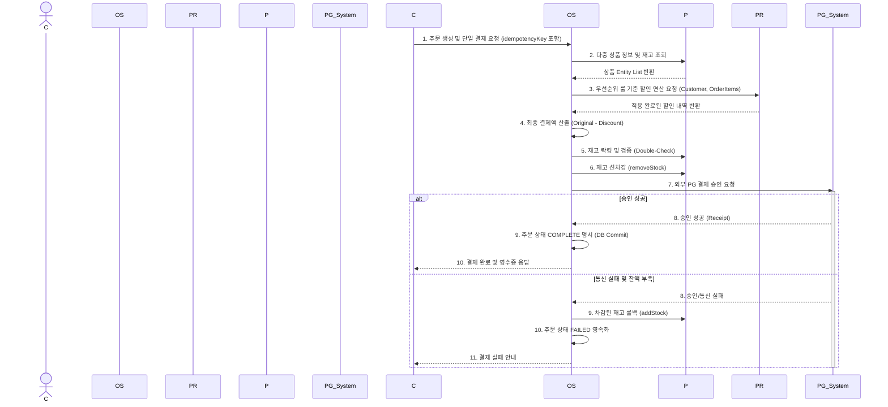

# [Analysis] 🛒 결제 및 할인 엔진 (Payment & Discount Engine)

| 항목 | 내용 |
| :--- | :--- |
| **Student No** | 22212025 |
| **Name** | 이진녕 |
| **E-mail** | vbnm963245@gmail.com |

**Project Title: OOP 원칙을 적용한 유연한 결제 및 할인 엔진 설계**

---

## [ Revision History ]

| Revision date | Version # | Description | Author |
| :--- | :--- | :--- | :--- |
| 2026/03/31 | 1.0.0 | First Draft 분석 문서 작성 | 이진녕 |
| 2026/04/28 | 1.1.0 | Use Case Specification 상세화 (General Characteristics, Main/Extension Scenarios, Related Information 추가) | 이진녕 |

---

## = Contents =

1. [Introduction](#1-introduction)
2. [Use case analysis](#2-use-case-analysis)
3. [Domain analysis](#3-domain-analysis)
4. [Interaction Diagram (Sequence)](#4-interaction-diagram-sequence)
5. [Glossary](#5-glossary)
6. [References](#6-references)

---

## 1. Introduction

### 1) Executive Summary
본 시스템("오픈소스 몰 엔진")은 이커머스의 핵심인 **'데이터 파이프라인의 설계와 정책 최적화'**에 초점을 맞추어 기획되었다. 대형 플랫폼의 폐쇄적인 정책 알고리즘과 기존 오픈소스(Magento 등)의 과도한 복잡성을 해결하기 위해, 상품 관리부터 지능형 할인 계산 및 결제 무결성 검증에 이르는 핵심 기능만을 모듈화한 경량 시스템이다. RDBMS 기반의 정규화된 데이터 처리와 확장에 열린(OCP) 코어 엔진 설계가 주된 특징이다.

### 2) Business Goals
* **운영 유연성 확보:** 정책 엔진 설정을 통해 코드 수정 없이 우선순위 기반의 마케팅 전략(쿠폰, 등급 혜택 등)을 즉시 반영하여 운영 효율을 제고한다.
* **TCO(총 소유 비용) 절감:** 소규모 기업이나 개발자도 고성능 결제/할인 메커니즘을 쉽게 도입하여 백엔드 개발에 드는 시간과 유지보수 비용을 획기적으로 줄여준다.
* **오류 없는 결제:** 금융 사고 방지를 위해 BigDecimal을 사용한 정밀 연산과 재고 처리의 단일 DB 트랜잭션 정합성을 보장한다.

### 3) Technical Goals
* **의존성 주입(DI) & 전략 패턴:** 새로운 할인 정책 추가 시 핵심 도메인 로직 수정 없이 정책을 확장할 수 있는 유연한 아키텍처 구현.
* **정밀 연산(BigDecimal):** 부동소수점 오차를 방지하기 위해 BigDecimal 기반 정밀 연산을 사용하는 견고한 도메인 계층 설계.
* **동시성 및 데이터 안전성:** 비관적 락(Pessimistic Lock)과 낙관적 락(Optimistic Lock) 전략을 비교·적용하여 단일 DB 트랜잭션 내에서 재고 차감의 정합성을 확보한다.
* **성능 목표:** 병목 방지를 위해 외부 I/O 및 DB 트랜잭션을 제외한 할인 계산 로직 단독 기준 평균 200ms 이하의 처리 속도를 달성한다.

---

## 2. Use case analysis

### 2.1 Use Case Diagram

### 2.2 Use Case Specification

---

#### UC1. 상품 정보 및 실시간 재고 관리

**GENERAL CHARACTERISTICS**

| 항목 | 내용 |
| :--- | :--- |
| **Summary** | 쇼핑몰 운영자가 상품의 기본 정보(이름, 가격, 설명)와 재고 수량을 등록·수정·삭제하여 상품 카탈로그를 관리하는 기능 |
| **Scope** | OSS Mall Engine (결제 및 할인 엔진 시스템) |
| **Level** | User-goal level |
| **Author** | 이진녕 |
| **Last Update** | 2026. 04. 28. |
| **Status** | Analysis (Finalize) |
| **Primary Actor** | 쇼핑몰 운영자/개발자 |
| **Preconditions** | 운영자가 관리자 권한으로 시스템에 인증(로그인)된 상태여야 한다. |
| **Trigger** | 운영자가 관리 콘솔에서 상품 등록/수정 메뉴에 진입할 때 |
| **Success Post Condition** | 상품 정보와 재고가 DB에 ACID 트랜잭션으로 영속화되고, 변경 사항이 즉시 소비자 조회 시 반영된다. |
| **Failed Post Condition** | DB 트랜잭션이 롤백되어 기존 상태가 유지되며, 운영자에게 실패 사유가 안내된다. |

**MAIN SUCCESS SCENARIO**

| Step | Action |
| :--- | :--- |
| S | 운영자가 관리자 권한으로 시스템에 로그인한다. |
| 1 | 운영자가 관리 콘솔에서 '상품 관리' 메뉴에 진입한다. |
| 2 | 운영자가 상품 명세(이름, 가격, 카테고리, 설명)와 초기 재고 수량을 입력한다. |
| 3 | 시스템이 입력값의 유효성을 검증한다 (가격 ≥ 0, 재고 ≥ 0, 필수 필드 확인). |
| 4 | 시스템이 DB에 ACID 트랜잭션으로 상품 정보를 저장한다. |
| 5 | 시스템이 저장 완료 메시지와 함께 등록된 상품 정보를 화면에 표시한다. |

**EXTENSION SCENARIOS**

| Step | Branching Action |
| :--- | :--- |
| 3 | 3a. 입력값 유효성 검증에 실패한다. |
|  | …3a1. 시스템이 유효하지 않은 필드와 사유를 명시한 오류 메시지를 표시한다. |
|  | …3a2. 운영자가 입력값을 수정하여 재제출한다. (Step 3으로 돌아간다) |
| 4 | 4a. DB 트랜잭션 저장에 실패한다 (DB 연결 오류, 제약 조건 위반 등). |
|  | …4a1. 시스템이 트랜잭션을 롤백하고 운영자에게 저장 실패를 안내한다. |

**RELATED INFORMATION**

| 항목 | 내용 |
| :--- | :--- |
| **Performance** | 상품 등록/수정 요청 후 ≤ 1 second 이내 응답 |
| **Frequency** | 운영자당 하루 평균 10~50회 |
| **Concurrency** | 동일 상품에 대한 동시 수정 시 낙관적 락(Optimistic Lock)으로 충돌 방지 |

---

#### UC2. 상품 검색 및 상세 조회

**GENERAL CHARACTERISTICS**

| 항목 | 내용 |
| :--- | :--- |
| **Summary** | 소비자가 상품을 카테고리 또는 키워드로 검색하고, 상세 정보(가격, 재고, 할인 적용가)를 조회하는 기능 |
| **Scope** | OSS Mall Engine (결제 및 할인 엔진 시스템) |
| **Level** | User-goal level |
| **Author** | 이진녕 |
| **Last Update** | 2026. 04. 28. |
| **Status** | Analysis (Finalize) |
| **Primary Actor** | 최종 소비자 |
| **Preconditions** | 없음 (비회원 및 회원 모두 접근 가능) |
| **Trigger** | 소비자가 검색창에 키워드를 입력하거나 카테고리 메뉴를 선택할 때 |
| **Success Post Condition** | 소비자가 검색 조건에 부합하는 상품 목록과 상세 정보를 확인할 수 있다. 회원인 경우 개인화된 할인 적용가가 함께 노출된다. |
| **Failed Post Condition** | 검색 결과가 없는 경우 "결과 없음" 안내와 함께 대체 추천 상품이 표시된다. |

**MAIN SUCCESS SCENARIO**

| Step | Action |
| :--- | :--- |
| S | 소비자가 쇼핑몰 메인 페이지에 접속한 상태이다. |
| 1 | 소비자가 검색창에 상품명 또는 카테고리를 입력/선택한다. |
| 2 | 시스템이 DB에서 검색 조건에 매칭되는 상품 목록을 조회한다. |
| 3 | 시스템이 각 상품의 메타데이터(이름, 가격, 썸네일)와 현재 재고 상태를 가공하여 목록을 표시한다. |
| 4 | 소비자가 특정 상품을 선택하여 상세 페이지에 진입한다. |
| 5 | 시스템이 상품 상세 정보(설명, 원가, 재고 수량)를 표시한다. 회원 로그인 상태인 경우 UC4를 `<<include>>`하여 할인 적용가를 함께 노출한다. |

**EXTENSION SCENARIOS**

| Step | Branching Action |
| :--- | :--- |
| 2 | 2a. 검색 결과가 0건이다. |
|  | …2a1. 시스템이 "검색 결과가 없습니다" 메시지를 표시한다. |
|  | …2a2. 시스템이 인기 상품 또는 유사 키워드 추천 목록을 제안한다. |
| 5 | 5a. 해당 상품의 재고가 0이다. |
|  | …5a1. 시스템이 "품절" 상태를 명시하고 장바구니 담기 버튼을 비활성화한다. |
|  | …5a2. 시스템이 재입고 알림 신청 옵션을 제공한다. |

**RELATED INFORMATION**

| 항목 | 내용 |
| :--- | :--- |
| **Performance** | 검색 결과 응답 ≤ 500ms, 상세 조회 응답 ≤ 300ms |
| **Frequency** | 소비자당 하루 평균 20~100회 |
| **Concurrency** | 제한 없음 (읽기 전용 요청이므로 동시성 이슈 없음) |

---

#### UC3. 할인 정책 설정 및 엔진 주입

**GENERAL CHARACTERISTICS**

| 항목 | 내용 |
| :--- | :--- |
| **Summary** | 운영자가 할인 정책(비율 할인, 정액 할인 등)을 설정하고 우선순위·배타성 규칙을 정의하여 Policy Resolver 엔진에 동적으로 주입하는 기능 |
| **Scope** | OSS Mall Engine (결제 및 할인 엔진 시스템) |
| **Level** | User-goal level |
| **Author** | 이진녕 |
| **Last Update** | 2026. 04. 28. |
| **Status** | Analysis (Finalize) |
| **Primary Actor** | 쇼핑몰 운영자/개발자 |
| **Preconditions** | 운영자가 관리자 권한으로 인증된 상태이며, 최소 1개 이상의 DiscountPolicy 구현체가 시스템에 존재해야 한다. |
| **Trigger** | 운영자가 새로운 마케팅 캠페인을 시작하거나 기존 할인 규칙을 변경하고자 할 때 |
| **Success Post Condition** | 새 할인 정책이 Policy Resolver에 등록되어, 이후 UC4의 할인 산출 시 즉시 반영된다. |
| **Failed Post Condition** | 정책 등록이 실패하여 기존 정책 설정이 그대로 유지되며, 운영자에게 실패 사유가 안내된다. |

**MAIN SUCCESS SCENARIO**

| Step | Action |
| :--- | :--- |
| S | 운영자가 관리자 권한으로 시스템에 로그인한다. |
| 1 | 운영자가 관리 콘솔에서 '할인 정책 관리' 메뉴에 진입한다. |
| 2 | 운영자가 정책 유형(RateDiscount / FixDiscount)을 선택하고 할인 값(비율 또는 정액), 우선순위(priority), 배타적 적용 여부(exclusive flag)를 설정한다. |
| 3 | 시스템이 정책 설정값의 유효성을 검증한다 (할인율 0~100%, 정액 ≥ 0, 우선순위 중복 여부 등). |
| 4 | 시스템이 AppConfig를 통해 해당 DiscountPolicy 구현체를 DI 컨테이너에 등록한다. |
| 5 | Policy Resolver가 새 정책을 우선순위 기반으로 정렬하여 룰 체인에 반영한다. |
| 6 | 시스템이 등록 완료 메시지와 현재 활성화된 정책 목록을 표시한다. |

**EXTENSION SCENARIOS**

| Step | Branching Action |
| :--- | :--- |
| 3 | 3a. 정책 설정값이 유효하지 않다 (예: 할인율 > 100%). |
|  | …3a1. 시스템이 유효성 오류 메시지를 표시한다. |
|  | …3a2. 운영자가 설정값을 수정하여 재제출한다. (Step 3으로 돌아간다) |
| 4 | 4a. 동일 우선순위의 기존 정책과 충돌이 발생한다. |
|  | …4a1. 시스템이 충돌 경고를 표시하고 기존 정책 교체 또는 우선순위 변경을 선택하게 한다. |
|  | …4a2. 운영자가 선택한 조치에 따라 시스템이 정책을 재구성한다. |

**RELATED INFORMATION**

| 항목 | 내용 |
| :--- | :--- |
| **Performance** | 정책 등록/변경 후 엔진 반영 ≤ 2 seconds |
| **Frequency** | 운영자당 월 평균 5~10회 (캠페인 주기) |
| **Concurrency** | 동시 정책 변경 시 직렬화 처리로 일관성 보장 |

---

#### UC4. 지능형 실시간 할인 금액 산출

**GENERAL CHARACTERISTICS**

| 항목 | 내용 |
| :--- | :--- |
| **Summary** | 소비자의 회원 등급, 보유 쿠폰, 다중 상품(OrderItem) 구성을 종합하여 Policy Resolver가 우선순위 기반 룰로 할인 금액을 BigDecimal 정밀 연산으로 실시간 산출하는 기능 |
| **Scope** | OSS Mall Engine (결제 및 할인 엔진 시스템) |
| **Level** | Sub-function level |
| **Author** | 이진녕 |
| **Last Update** | 2026. 04. 28. |
| **Status** | Analysis (Finalize) |
| **Primary Actor** | 최종 소비자 |
| **Secondary Actor** | OSS Mall Engine (Policy Resolver) |
| **Preconditions** | 1. 소비자의 장바구니에 1개 이상의 상품(OrderItem)이 존재해야 한다. 2. UC3을 통해 최소 1개 이상의 할인 정책이 Policy Resolver에 등록된 상태여야 한다. |
| **Trigger** | 소비자가 장바구니 조회 또는 결제 요청 시, 시스템이 최종 결제액 산출을 위해 자동 호출할 때 |
| **Success Post Condition** | 각 OrderItem별 적용된 할인 내역(appliedDiscounts)과 총 할인 금액이 BigDecimal로 정확히 산출되어 반환된다. |
| **Failed Post Condition** | 할인 산출에 실패할 경우, 할인 없이 원가 기준 금액이 반환되며 오류 로그가 기록된다. |

**MAIN SUCCESS SCENARIO**

| Step | Action |
| :--- | :--- |
| S | 소비자가 장바구니를 조회하거나 결제를 요청한 상태이다. |
| 1 | 시스템이 소비자의 회원 정보(등급, 보유 쿠폰)를 조회한다. (`<<include>>` UC2의 상품 정보 활용) |
| 2 | 시스템이 장바구니의 다중 OrderItem 목록과 각 상품의 현재 가격·재고를 획득한다. |
| 3 | Policy Resolver가 등록된 정책들을 우선순위(priority) 순서로 정렬한다. |
| 4 | Policy Resolver가 각 OrderItem에 대해 순차적으로 할인 정책을 적용한다. exclusive 플래그가 true인 정책이 적용되면 해당 항목의 후속 정책 적용을 중단한다. |
| 5 | 시스템이 각 OrderItem의 할인 내역(DiscountInfo)을 기록하고, 총 할인 금액을 BigDecimal로 합산한다. |
| 6 | 시스템이 최종 결제 예상 금액(totalOriginalPrice − totalDiscountAmount)을 소비자에게 반환한다. |

**EXTENSION SCENARIOS**

| Step | Branching Action |
| :--- | :--- |
| 1 | 1a. 비회원(비로그인) 소비자가 요청한 경우. |
|  | …1a1. 시스템이 등급을 BASIC으로 기본 설정하고 쿠폰 없이 진행한다. (Step 2로 진행) |
| 4 | 4a. 할인 적용 후 금액이 음수가 된다. |
|  | …4a1. 시스템이 해당 OrderItem의 최종 금액을 0원으로 하한 보정(floor)한다. |
| 5 | 5a. Policy Resolver에서 런타임 예외가 발생한다. |
|  | …5a1. 시스템이 할인 없이 원가 기준 금액을 반환하고 오류 로그를 기록한다. |
|  | …5a2. 시스템이 소비자에게 "할인 적용에 일시적 문제가 발생했습니다" 안내를 표시한다. |

**RELATED INFORMATION**

| 항목 | 내용 |
| :--- | :--- |
| **Performance** | 외부 I/O 제외, 할인 연산 로직 단독 기준 ≤ 200ms |
| **Frequency** | 소비자 결제 요청 시마다 (일 평균 수백~수천 회) |
| **Concurrency** | 제한 없음 (읽기 전용 연산, 상태 변경 없음) |

---

#### UC5. 결제 승인 및 데이터 무결성 검증

**GENERAL CHARACTERISTICS**

| 항목 | 내용 |
| :--- | :--- |
| **Summary** | 소비자의 결제 요청을 받아 재고 락킹·선차감, 외부 PG사 승인, 주문 데이터 생성을 단일 트랜잭션으로 처리하여 데이터 무결성과 Oversell 방지를 보장하는 기능 |
| **Scope** | OSS Mall Engine (결제 및 할인 엔진 시스템) |
| **Level** | User-goal level |
| **Author** | 이진녕 |
| **Last Update** | 2026. 04. 28. |
| **Status** | Analysis (Finalize) |
| **Primary Actor** | 최종 소비자 |
| **Secondary Actor** | 외부 PG사 (Payment Gateway) |
| **Preconditions** | 1. UC4를 통해 최종 결제액이 정확히 산출된 상태여야 한다. 2. 소비자가 회원 인증(로그인)된 상태여야 한다. 3. 주문에 유효한 idempotencyKey가 포함되어야 한다. |
| **Trigger** | 소비자가 최종 결제 금액을 확인하고 '결제하기' 버튼을 클릭할 때 |
| **Success Post Condition** | 주문 상태가 COMPLETE로 영속화되고, 재고가 차감되며, PG 승인 영수증이 기록된다. 소비자에게 결제 완료 및 영수증이 응답된다. |
| **Failed Post Condition** | 선차감된 재고가 롤백되고, 주문 상태가 FAILED로 영속화된다. 소비자에게 실패 사유가 안내된다. |

**MAIN SUCCESS SCENARIO**

| Step | Action |
| :--- | :--- |
| S | 소비자가 UC4의 할인 산출이 완료된 결제 확인 화면에 있다. |
| 1 | 소비자가 결제 수단을 선택하고 '결제하기' 버튼을 클릭한다. |
| 2 | 시스템이 idempotencyKey 중복 여부를 확인한다 (멱등성 검증). |
| 3 | 시스템이 DB에서 주문 대상 상품들의 잔여 재고를 비관적 락(Pessimistic Lock)으로 즉시 락킹한다. |
| 4 | 시스템이 재고 수량을 검증(Double-Check)하고 선차감(removeStock)을 수행한다. (`<<include>>` UC4 할인 산출 결과 활용) |
| 5 | 시스템이 외부 PG사에 결제 승인 요청을 전송한다 (결제 금액, 소비자 정보 포함). |
| 6 | PG사가 승인 성공 응답(Receipt)을 반환한다. |
| 7 | 시스템이 주문 데이터를 생성하고 주문 상태를 COMPLETE로 설정하여 DB Commit한다. |
| 8 | 시스템이 소비자에게 결제 완료 및 영수증 정보를 응답한다. |

**EXTENSION SCENARIOS**

| Step | Branching Action |
| :--- | :--- |
| 2 | 2a. 동일 idempotencyKey의 기존 주문이 존재한다 (중복 결제 시도). |
|  | …2a1. 시스템이 기존 주문 결과를 그대로 반환하고 중복 처리를 차단한다. |
| 4 | 4a. 재고가 주문 수량보다 부족하다. |
|  | …4a1. 시스템이 락을 해제하고 "재고 부족" 오류 메시지를 소비자에게 반환한다. |
|  | …4a2. 소비자가 수량을 조정하여 재요청한다. (Step 1로 돌아간다) |
| 6 | 6a. PG사 승인이 실패한다 (잔액 부족, 카드 오류 등). |
|  | …6a1. 시스템이 선차감된 재고를 롤백(addStock)한다. |
|  | …6a2. 시스템이 주문 상태를 FAILED로 영속화한다. |
|  | …6a3. 시스템이 소비자에게 결제 실패 사유를 안내한다. |
| 6 | 6b. PG사 통신 자체가 타임아웃/장애로 실패한다. |
|  | …6b1. 시스템이 선차감된 재고를 롤백(addStock)한다. |
|  | …6b2. 시스템이 주문 상태를 FAILED로 영속화하고 재시도 안내를 표시한다. |

**RELATED INFORMATION**

| 항목 | 내용 |
| :--- | :--- |
| **Performance** | 재고 락킹~PG 승인 포함 전체 결제 프로세스 ≤ 5 seconds |
| **Frequency** | 일 평균 수백~수천 건 (서비스 규모에 따라 변동) |
| **Concurrency** | 동일 상품에 대한 동시 결제 요청 시 비관적 락(Pessimistic Lock)으로 재고 정합성 보장 |

> 💡 **설계 의도:** 재고 차감 시점은 데이터 일관성(Oversell 방지) vs 응답 성능(Lock 유지 시간)의 트레이드오프를 고려하여 **선차감 방식**을 선택함. PG 승인 실패 시 재고 롤백으로 보상 트랜잭션을 수행한다.

---

## 3. Domain analysis

본 엔진은 객체지향의 다형성과 역할 분리를 강조합니다.

### 3.1 Domain Model (Class Diagram)

### 3.2 Domain Concepts Description
* **Customer & Grade:** 회원 정보를 표현하며 시스템 내 할인 정책의 중요한 판별 컨텍스트가 됩니다.
* **Product:** 상품 도메인 모델로 DB와 매핑되어 실제 재고 증감을 스스로 판별하고 관리하는 비즈니스 로직(응집도)을 갖습니다.
* **Order & OrderItem:** 클라이언트의 중복 결제를 방지하기 위한 식별자(`idempotencyKey`)를 포함하는 주문 엔티티입니다. **동일 `idempotencyKey` 요청 시 중복 처리 없이 기존 주문 결과를 반환**하여 안전성을 보장합니다. 여러 상품(`Product`)과 고유 수량, 적용된 할인 내역(`appliedDiscounts`)을 담아 관리하는 `OrderItem` 리스트를 구성해 현실적으로 확장하였습니다.
* **DiscountPolicy:** 핵심 전략 인터페이스입니다. 다형성을 제공하며 코드 단에 `getPriority()`를 명시해 우선순위 기반으로 규칙을 정의하고 단독 적용 여부(`exclusive flag`)를 가집니다.
* **PolicyResolver:** 복수의 DiscountPolicy를 주입받아 설정된 룰(우선순위, Exclusive 속성)에 기반해 순차적으로/일괄적으로 할인을 명확히 결합하는 실행 컴포넌트입니다.

---

## 4. Interaction Diagram (Sequence)

소비자가 상품 주문을 최종적으로 요청하고 결제가 승인되기까지의 객체 간 상호작용(Sequence) 흐름입니다.

---

## 5. Glossary

*   **Policy Resolver:** 우선순위 규칙과 exclusive flag에 입각해 여러 정책을 결합하고 할인을 부여하는 룰 실행 컴포넌트.
*   **BigDecimal:** 부동소수점 오차 발현을 방지하여 정교한 금액 계산을 책임지는 Java 타입.
*   **Idempotency (멱등성):** 동일 트랜잭션 식별자(`idempotencyKey`)로 재요청이 반복되더라도 결제 중복 및 데이터 꼬임 현상을 차단하여 시스템 일관성을 유지하는 개념.
*   **비관적 락(Pessimistic Lock):** 다중 요청 시나리오에서 데이터 조회 시점부터 DBMS 락을 획득하여 동시성에 따른 재고 초과 차감을 방어하는 기법.

---

## 6. References

1.  **Shopify Blog (2026):** "최고의 무료 오픈 소스 전자상거래 플랫폼 5가지"
2.  **Adobe Commerce (Magento) Developer Documentation**
3.  **Robert C. Martin:** "Clean Architecture" 및 "SOLID" 가이드
4.  **Spring Framework Reference Documentation:** DI 및 Transaction Management 참조.
