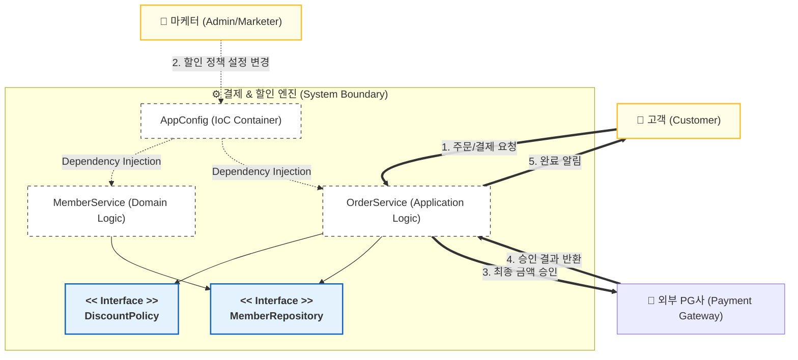

# [Conceptualization] 🛒 OOP 원칙 기반 유연한 결제 및 할인 엔진 (Payment & Discount Engine)

| 항목 | 내용 |
| :--- | :--- |
| **Student No** | 22212025 |
| **Name** | 이진녕 |
| **E-mail** | vbnm9247@naver.com |

**Project Title: SOLID 원칙을 적용한 설정 기반 결제 정책 엔진 설계**

---

## [ Revision history ]

| Revision date | Version # | Description | Author |
| :--- | :--- | :--- | :--- |
| 2026/03/17 | 1.0.0 | 프로젝트 배경 및 비즈니스 목적 정의 초안 작성 | 이진녕 |
| 2026/03/18 | 1.1.0 | 시스템 컨텍스트 다이어그램 및 핵심 인터페이스 설계 구체화 | 이진녕 |
| 2026/03/18 | 1.2.0 | 운영 개념(Concept of Operation) 및 기술적 난제(Problem Statement) 보완 | 이진녕 |

---

## Contents
1. Business Purpose
2. System Context Diagram
3. Use Case List
4. Concept of Operation
5. Problem Statement
6. Glossary
7. References

---

## 1. Business Purpose

### 1.1 Project Background & Motivation
현대 이커머스 비즈니스 환경은 극심한 변동성을 특징으로 합니다. 블랙 프라이데이, 시즌별 프로모션, 회원 등급별 특화 혜택 등 마케팅 전략은 실시간에 가깝게 변화하며, 시스템은 이에 즉각적으로 대응할 수 있어야 합니다. 

> **Technical Pain Point:** 기존의 명령형 프로그래밍 방식(Imperative Programming)에서는 새로운 할인 정책이 추가될 때마다 핵심 결제 로직(`OrderService`) 내부에 `if-else` 문이 증식하게 됩니다. 이는 코드의 가독성을 저해할 뿐만 아니라, 단일 책임 원칙(SRP)을 위반하며 사소한 정책 변경에도 전체 시스템을 재배포해야 하는 운영 리스크를 초래합니다.

### 1.2 Project Goal
*   **유연한 정책 전환(Policy Agility):** 소스 코드 수정 없이 설정 객체(`AppConfig`)의 변경만으로 할인 정책을 즉시 교체할 수 있는 구조를 구축합니다.
*   **결합도 최소화(Loose Coupling):** 인터페이스 기반 설계를 통해 비즈니스 로직이 구체적인 구현체에 의존하지 않도록 설계합니다. (DIP 준수)
*   **확장성 확보(Extensibility):** 신규 할인 정책(예: 정률 할인) 도입 시 기존 코드를 수정하지 않고 새로운 클래스를 추가함으로써 기능을 확장합니다. (OCP 준수)

### 1.3 Target Market
*   빈번한 이벤트와 프로모션이 발생하는 중소규모 이커머스 플랫폼 개발사.
*   객체지향 설계 원칙을 실무 코드에 적용하고자 하는 백엔드 아키텍트.

---

## 2. System Context Diagram

본 시스템은 외부 행위자(Actor)와 내부 컴포넌트 간의 명확한 역할 분리를 지향합니다.

### 2.1 Component Description
*   **Customer:** 상품을 구매하고 할인이 적용된 최종 금액을 지불하는 주체.
*   **Admin/Marketer:** 비즈니스 상황에 따라 할인 정책(정액 vs 정률)을 결정하고 시스템에 반영하는 관리자.
*   **AppConfig:** 객체의 생성과 의존관계 주입(DI)을 담당하는 IoC 컨테이너. 제어의 역전을 통해 아키텍처의 유연성을 보장함.
*   **OrderService:** 회원 정보 확인 및 할인 정책 호출을 통해 최종 주문 객체를 생성하는 핵심 서비스.
*   **DiscountPolicy (Interface):** 다양한 할인 전략을 추상화한 인터페이스로, 구체적인 알고리즘을 캡슐화함 (Strategy Pattern).

---

## 3. Use Case List

| ID | Use Case Name | Actor | Description |
| :--- | :--- | :--- | :--- |
| **UC-01** | 회원 가입 및 관리 | Customer | 고객 정보를 시스템에 등록하며, BASIC/VIP 등급을 부여받음. |
| **UC-02** | 주문 생성 및 결제 | Customer | 선택한 상품에 대해 회원 등급별 할인 정책을 적용하여 최종 결제 금액 산출. |
| **UC-03** | 할인 정책 실시간 교체 | Admin | 소스 코드 배포 없이 `AppConfig` 수정을 통해 정액/정률 할인 정책을 전환. |
| **UC-04** | 외부 PG 승인 연동 | System | 산출된 최종 금액에 대해 외부 전자결제 대행사(PG)와 통신하여 결제 승인. |

---

## 4. Concept of Operation (ConOps)

### 4.1 핵심 유즈케이스 작동 개념

| Item | UC-02: 주문 생성 및 결제 | UC-03: 할인 정책 실시간 교체 |
| :--- | :--- | :--- |
| **Purpose** | 정확한 할인액 계산을 통한 주문 처리 | 비즈니스 가변성에 대한 즉각적인 대응 |
| **Approach** | **Strategy Pattern** 적용: 인터페이스를 통해 할인 로직을 동적으로 호출 | **DI (Dependency Injection)** 활용: 설정 클래스에서 구현체를 교체하여 주입 |
| **Dynamics** | OrderService가 DiscountPolicy 인터페이스를 호출하면, 런타임에 주입된 실제 객체가 로직 수행 | Admin이 AppConfig의 `return new ...Policy()` 부분 수정 시 전체 시스템에 변경 사항 전파 |
| **Goals** | 데이터 무결성 확보 및 비즈니스 로직 보호 | **Open-Closed Principle (OCP)** 극대화 |

---

## 5. Problem Statement

### 5.1 Technical Challenges (기술적 난제)
1.  **순환 참조(Circular Dependency):** `MemberService`와 `OrderService`가 서로를 참조할 경우 발생하는 컨텍스트 초기화 실패 문제 해결 필요.
2.  **DI/IoC 컨테이너 설계:** 수동 DI 방식에서 Spring의 `ApplicationContext`로 전환 시, 빈(Bean) 스코프 및 생명주기 관리 전략 수립.
3.  **동적 정책 조회:** 런타임에 여러 정책이 동시에 존재할 경우, 특정 조건에 맞는 정책을 선별하는 로직의 복잡도 관리.

### 5.2 Non-Functional Requirements (NFRs)
1.  **Scalability (확장성):** 초당 1,000건 이상의 주문 생성 요청에도 지연 없는 할인 로직 수행.
2.  **Maintainability (유지보수성):** 새로운 할인 정책 추가 시 기존 코드 변경 범위를 0%로 유지.
3.  **Accuracy (정확성):** 정률 할인 정책 적용 시 발생하는 소수점 버림/반올림 오차에 대한 비즈니스 정밀도 확보.

---

## 6. Glossary

*   **SOLID:** 객체지향 설계의 5가지 핵심 원칙 (SRP, OCP, LSP, ISP, DIP).
*   **DIP (Dependency Inversion Principle):** 고수준 모듈이 저수준 모듈에 의존하지 않고 추상화에 의존해야 한다는 원칙.
*   **IoC (Inversion of Control):** 객체의 제어권(생성, 생명주기 관리)을 개발자가 아닌 프레임워크나 외부 컨테이너로 넘기는 것.
*   **AppConfig:** 애플리케이션의 환경 설정과 의존관계 주입을 담당하는 구성 클래스.
*   **VIP/BASIC:** 서비스 내에서 할인 혜택 차등 적용을 위한 고객 등급 구분.

---

## 7. References

*   Robert C. Martin, *"Clean Architecture: A Craftsman's Guide to Software Structure and Design"*, Prentice Hall.
*   Spring Boot Documentation, *"Core Technologies - Dependency Injection"*, [Official Docs].
*   Erich Gamma et al., *"Design Patterns: Elements of Reusable Object-Oriented Software"*.
