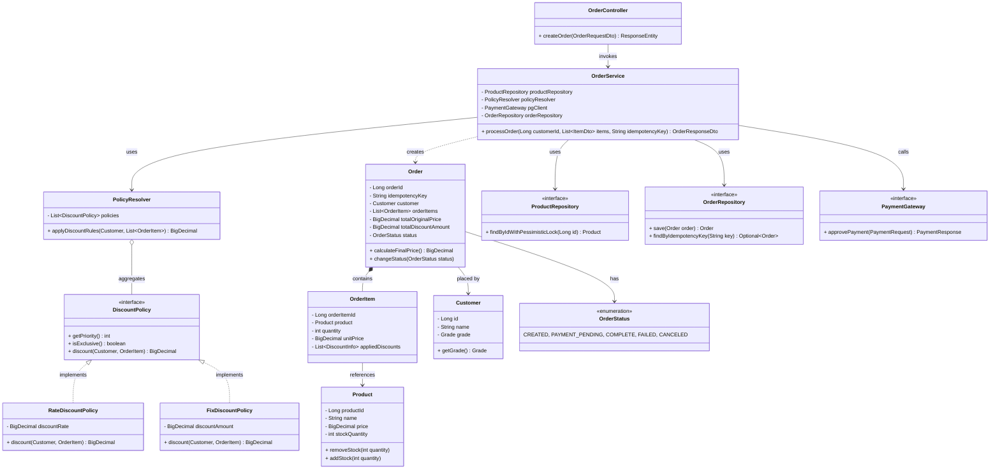
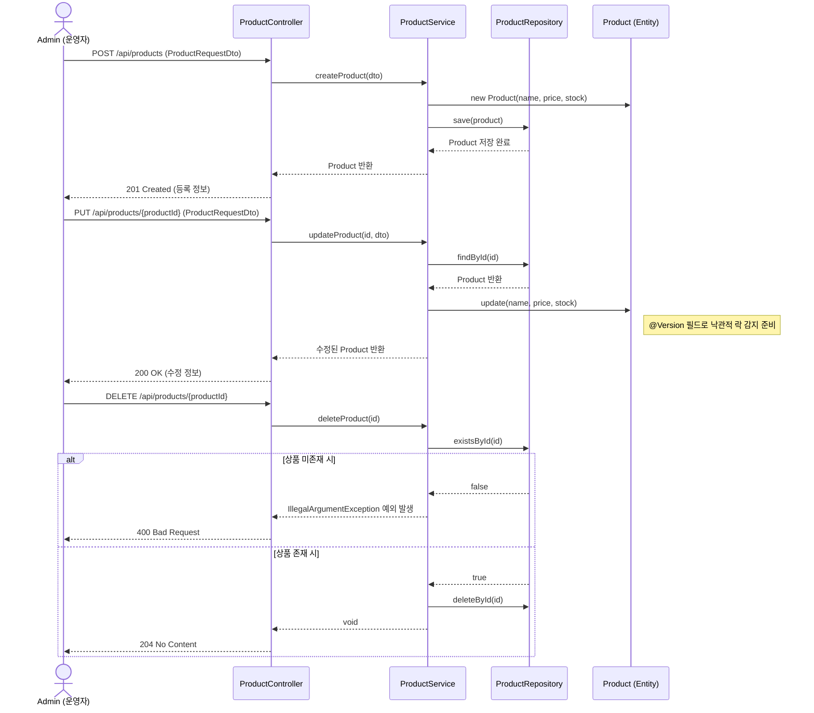
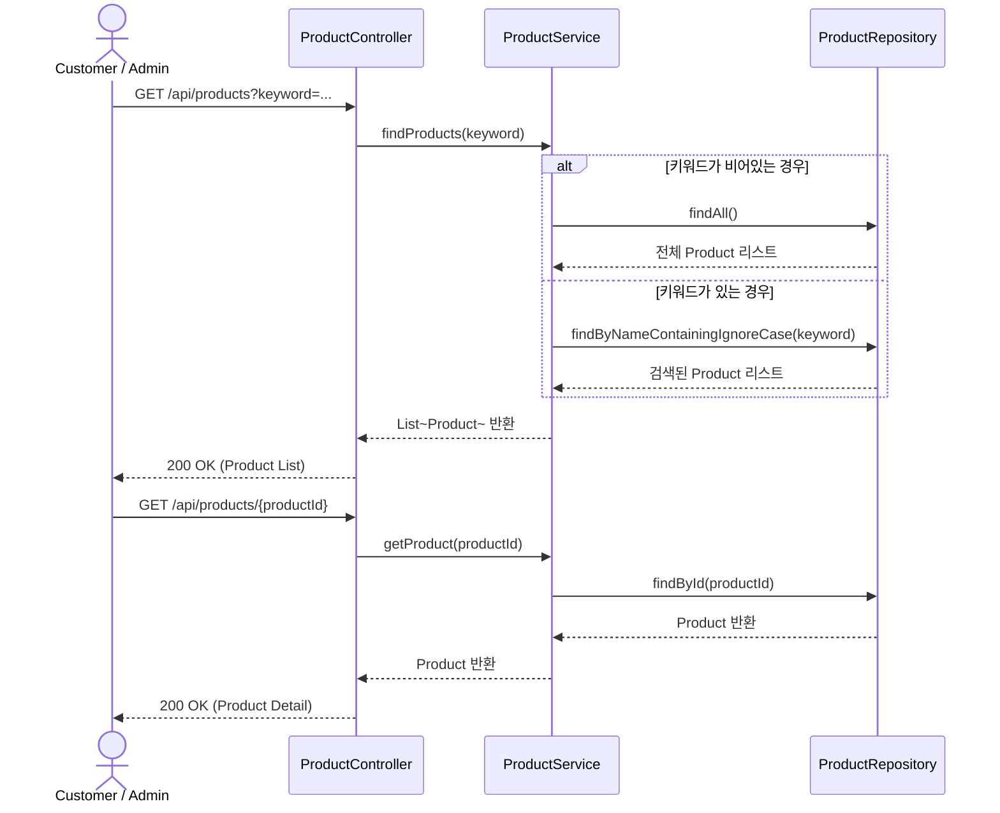
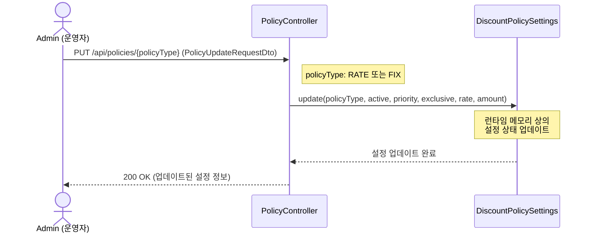
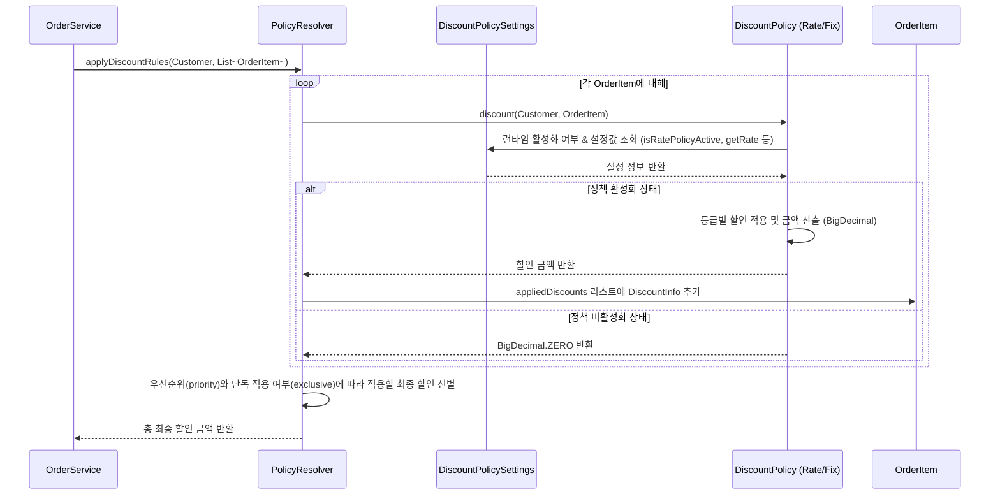
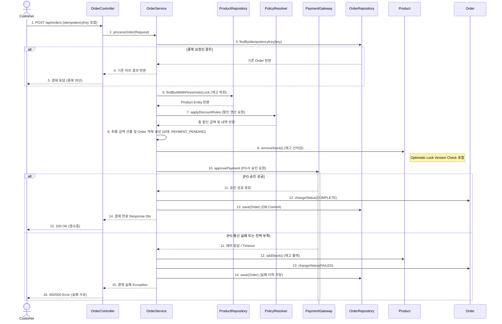
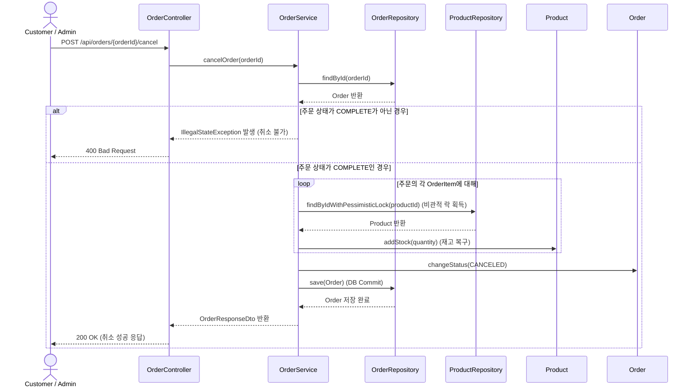
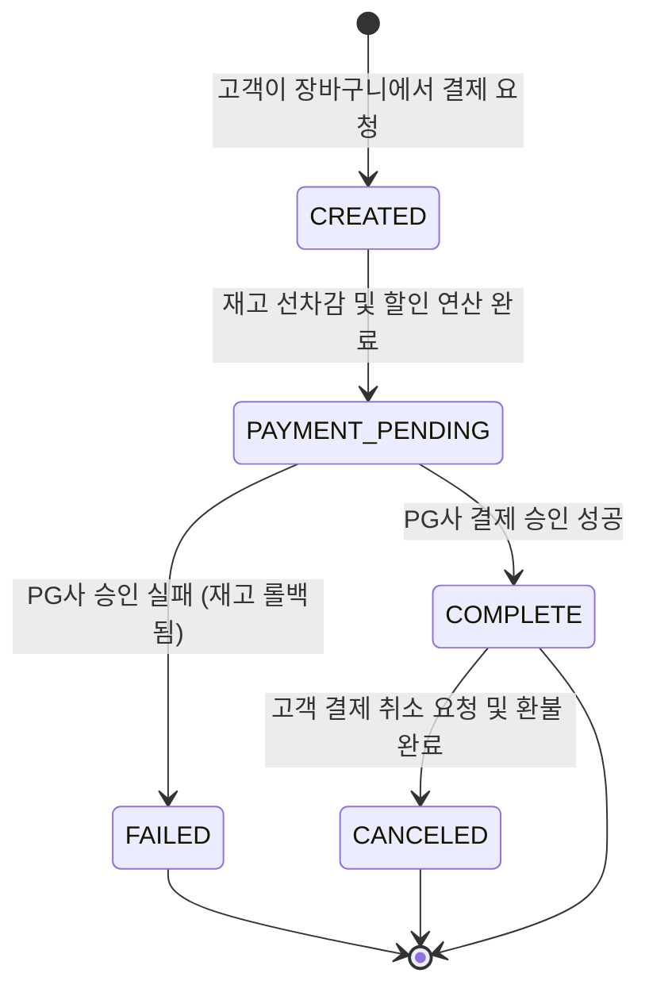

# [Design] 🛒 결제 및 할인 엔진 (Payment & Discount Engine)

| 항목 | 내용 |
| :--- | :--- |
| **Student No** | 22212025 |
| **Name** | 이진녕 |
| **E-mail** | vbnm963245@gmail.com |

**Project Title: OOP 원칙을 적용한 유연한 결제 및 할인 엔진 설계**

---

## [ Revision History ]

| Revision date | Version # | Description | Author |
| :--- | :--- | :--- | :--- |
| 2026/05/08 | 1.0.0 | First Draft 설계 문서 작성 | 이진녕 |
| 2026/06/08 | 1.0.1 | 유즈케이스 별 시퀀스 다이어그램 보충 | 이진녕 |

---

## = Contents =

1. [Introduction](#1-introduction)
2. [Class Diagram](#2-class-diagram)
3. [Sequence Diagram](#3-sequence-diagram)
4. [State machine Diagram](#4-state-machine-diagram)
5. [Implementation Requirements](#5-implementation-requirements)
6. [Glossary](#6-glossary)
7. [References](#7-references)

---

## 1. Introduction

### 1) Executive Summary
본 시스템("오픈소스 몰 엔진")은 이커머스의 핵심인 **'데이터 파이프라인의 설계와 정책 최적화'**에 초점을 맞추어 기획 및 분석된 내용을 바탕으로 실제 소프트웨어 구현을 위한 구체적인 아키텍처와 객체 설계를 명세한다. 분석 단계에서 도출된 도메인 모델을 확장하여 Controller, Service, Repository 계층을 포함한 상세 Class Diagram과 흐름을 정의하며, 특히 Spring Framework 기반의 의존성 주입(DI)과 전략 패턴(Strategy Pattern)을 활용한 설계의 이점을 구체화한다.

### 2) Design Goals (설계 목표)
* **모듈화 및 관심사 분리(SoC):** UI/API 계층(Controller), 비즈니스 로직(Service), 데이터 접근(Repository)을 철저히 분리하여 유지보수성을 극대화한다.
* **유연한 정책 확장(OCP 준수):** `DiscountPolicy` 인터페이스와 `PolicyResolver`를 통해 기존 코드를 수정하지 않고도 새로운 할인 정책을 추가할 수 있는 아키텍처를 설계한다.
* **정합성 및 동시성 제어:** 다수의 동시 결제 요청에 따른 재고 부족(Oversell) 문제를 방지하기 위해 DB 수준의 비관적 락(Pessimistic Lock)을 `ProductRepository`에 적용하여 일관성을 보장한다.
* **정밀 연산 설계:** 모든 금전적 데이터 연산은 `BigDecimal`을 사용하여 부동소수점 오차를 원천적으로 차단한다.

---

## 2. Class Diagram

분석 단계의 도메인 모델을 바탕으로 시스템의 전반적인 구조(Controller - Service - Repository - Domain)를 표현한 상세 클래스 다이어그램이다.

### 설계 핵심 포인트
* **Repository 분리:** `ProductRepository`에 `findByIdWithPessimisticLock` 메서드를 명시하여 재고 접근 시 락(Lock)을 획득하도록 설계.
* **OrderService 주도:** 트랜잭션의 진입점으로, 멱등성 검증, 재고 차감, 할인 적용, 결제 승인 요청을 오케스트레이션(Orchestration)함.

---

## 3. Sequence Diagram

각 유즈케이스별 상세 호출 흐름 및 컴포넌트 간 상호작용을 표현한 시퀀스 다이어그램이다.

### 3.1 UC1. 상품 정보 및 실시간 재고 관리 (등록, 수정, 삭제)

### 3.2 UC2. 상품 검색 및 상세 조회

### 3.3 UC3. 할인 정책 설정 및 엔진 주입

### 3.4 UC4. 지능형 실시간 할인 금액 산출

### 3.5 UC5. 결제 승인 및 데이터 무결성 검증 (주문 처리)

### 3.6 UC6. 주문 취소 및 재고 복구

---

## 4. State machine Diagram

주문(Order) 객체의 생명주기와 상태 변화를 표현한 State Machine Diagram이다. 이를 통해 결제 및 재고 처리 과정에서의 상태 전이 규칙을 명확히 한다.

* **CREATED:** 주문 정보가 최초 수신되어 검증 중인 상태.
* **PAYMENT_PENDING:** 할인 산출이 끝나고 상품의 재고가 선차감(비관적 락 확보)되었으나 외부 PG 통신이 아직 완료되지 않은 대기 상태.
* **COMPLETE:** 시스템 내재화가 정상적으로 끝나고 데이터가 Commit된 최종 상태.
* **FAILED:** 한도 초과, 통신 에러 등으로 결제가 중단되어 보상 트랜잭션(재고 복구)이 실행된 상태.

---

## 5. Implementation Requirements

본 설계를 코드로 구현하기 위한 기술 스택 및 개발 요구사항은 다음과 같다.

| 항목 | 요구사항 및 기술 스택 | 설명 |
| :--- | :--- | :--- |
| **Language** | Java 17 이상 | 최신 문법(Record, Text Blocks 등) 활용 및 장기 지원(LTS) 안정성 확보 |
| **Framework** | Spring Boot 3.x | 의존성 주입(DI) 및 웹(MVC) 애플리케이션의 신속한 구성 |
| **Database** | MySQL 8.x (Prod) H2 Database (Test) | 관계형 데이터베이스 매핑. 비관적 락 동작 검증 지원 |
| **ORM** | Spring Data JPA (Hibernate) | 데이터 영속성 관리 및 `@Lock(LockModeType.PESSIMISTIC_WRITE)` 지원 |
| **Precision Math** | `java.math.BigDecimal` | 금액 및 할인율 산출 시 부동소수점 오차 방지를 위한 필수 데이터 타입 |
| **Testing** | JUnit 5, Mockito | PolicyResolver 및 재고 차감 동시성(Multi-thread)에 대한 통합/단위 테스트 |
| **Architecture** | Layered Architecture | Controller, Service, Repository, Domain 계층의 명확한 분리 및 응집도 향상 |

---

## 6. Glossary

*   **Pessimistic Lock (비관적 락):** 트랜잭션 충돌이 발생할 것이라 가정하고 조회 시점부터 데이터베이스의 Row 단위 락을 걸어 정합성을 보장하는 기술.
*   **Layered Architecture (계층형 아키텍처):** 소프트웨어를 역할 단위(표현, 비즈니스, 데이터 계층 등)로 나누어 설계하는 아키텍처 패턴.
*   **Idempotency Key (멱등성 키):** 중복 결제 요청 방지를 위해 클라이언트가 생성하여 전달하는 고유 식별자.
*   **Compensation Transaction (보상 트랜잭션):** 분산 시스템이나 외부 연동(PG)에서 실패가 발생했을 때, 이전 단계에서 수행된 작업(예: 재고 선차감)을 원래 상태로 되돌리는 작업.

---

## 7. Implementation Alignment Addendum

본 보충 절은 실제 구현 코드와 설계 문서 사이의 추적성을 높이기 위해 추가한다. 기존 설계 문서가 결제 승인 흐름(UC5)을 중심으로 작성되어 있었으므로, 구현에서는 분석 문서의 UC1, UC2, UC3, 주문 취소 상태까지 포함하도록 API와 서비스를 확장하였다.

### 7.1 Use Case to Implementation Mapping

| Use Case | Implemented Component | Endpoint / Method | Notes |
| :--- | :--- | :--- | :--- |
| UC1. 상품 정보 및 실시간 재고 관리 | `ProductController`, `ProductService`, `ProductRepository`, `Product` | `POST /api/products`, `PUT /api/products/{productId}`, `DELETE /api/products/{productId}` | 상품 등록, 수정, 삭제를 지원한다. 상품 수정 충돌 감지를 위해 `Product`에 `@Version` 기반 optimistic locking을 적용한다. |
| UC2. 상품 검색 및 상세 조회 | `ProductController`, `ProductService` | `GET /api/products?keyword=...`, `GET /api/products/{productId}` | 전체 상품 조회, 이름 기반 검색, 단건 상세 조회를 지원한다. |
| UC3. 할인 정책 설정 및 엔진 주입 | `PolicyController`, `DiscountPolicySettings`, `RateDiscountPolicy`, `FixDiscountPolicy`, `PolicyResolver` | `GET /api/policies`, `PUT /api/policies/{RATE\|FIX}` | 할인 정책의 활성화 여부, 우선순위, exclusive 속성, 할인율/정액 값을 런타임에 조정한다. `PolicyResolver`는 매 계산 시점에 최신 priority를 반영한다. |
| UC4. 지능형 실시간 할인 금액 산출 | `PolicyResolver`, `DiscountPolicy`, `DiscountInfo`, `OrderItem` | `OrderService.processOrder()` 내부 호출 | `BigDecimal` 기반으로 할인 금액을 계산하고, 상품 가격을 초과하는 할인은 0원 하한으로 보정한다. |
| UC5. 결제 승인 및 데이터 무결성 검증 | `OrderController`, `OrderService`, `PaymentGateway`, `OrderRepository`, `ProductRepository` | `POST /api/orders` | idempotencyKey 중복 검증, 비관적 락 기반 재고 차감, PG 승인, 실패 시 보상 트랜잭션을 수행한다. |
| 주문 취소/환불 확장 | `OrderService.cancelOrder()` | `POST /api/orders/{orderId}/cancel` | `COMPLETE` 주문을 `CANCELED`로 전이하고 차감된 재고를 복구한다. |

### 7.2 Locking Strategy Clarification

동시성 제어는 사용 시나리오에 따라 분리한다.

* **상품 관리 수정(UC1):** 운영자의 상품 정보 수정은 충돌 빈도가 낮으므로 `Product.version`의 `@Version`을 통한 optimistic locking을 사용한다.
* **결제 재고 차감(UC5):** 동일 상품에 대한 동시 결제 요청은 oversell 위험이 크므로 `ProductRepository.findByIdWithPessimisticLock()`에 `LockModeType.PESSIMISTIC_WRITE`를 적용한다.
* **주문 취소:** 재고 복구 역시 결제와 같은 재고 변경 흐름이므로 상품 row에 pessimistic lock을 획득한 뒤 `addStock()`을 수행한다.

### 7.3 Policy Configuration Model

할인 정책은 `DiscountPolicy` 인터페이스로 확장 가능하게 유지하면서, 기본 구현체 두 개를 제공한다.

* `RateDiscountPolicy`: VIP/VVIP 등급에 비율 할인 적용. 기본값은 10%.
* `FixDiscountPolicy`: 상품별 정액 할인 적용. 기본값은 1,000원이며 기본 설정은 exclusive이다.
* `DiscountPolicySettings`: 정책 활성화, 우선순위, exclusive 여부, 할인율, 정액 할인 금액을 보관하는 런타임 설정 컴포넌트이다.
* `PolicyController`: 운영자가 정책 설정을 조회하거나 변경할 수 있는 API를 제공한다.

### 7.4 Verification

구현 보강 후 다음 테스트로 설계 요구사항을 검증한다.

* `PolicyResolverTest`: 우선순위 기반 할인, exclusive 정책, 0원 하한 보정, 런타임 정책 비활성화 검증.
* `OrderServiceConcurrencyTest`: 30개 동시 결제 요청에서 재고 10개만 성공하는 pessimistic locking 검증, `COMPLETE -> CANCELED` 취소 시 재고 복구 검증.

---

## 8. References

1.  **Spring Framework Reference Documentation:** Spring Boot 3.x 기반의 의존성 주입(DI) 및 Transaction Management (`@Transactional`, 락킹 메커니즘).
2.  **Hibernate ORM Documentation:** JPA Pessimistic Locking 전략 적용 가이드.
3.  **Martin Fowler:** "Patterns of Enterprise Application Architecture" (도메인 모델 패턴 및 트랜잭션 스크립트 분리).
4.  **Robert C. 정 마틴:** "Clean Architecture" 및 "SOLID" 객체지향 설계 원칙 가이드라인.
