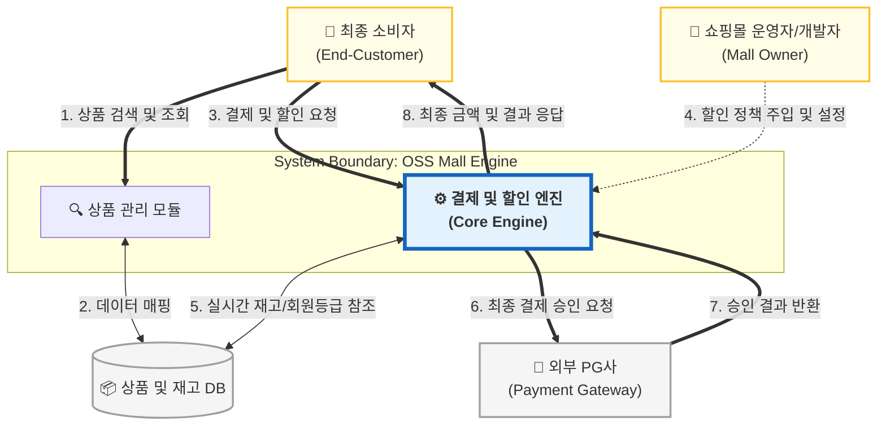

# [Conceptualization] 🛒 결제 및 할인 엔진 (Payment & Discount Engine)

| 항목 | 내용 |
| :--- | :--- |
| **Student No** | 22212025 |
| **Name** | 이진녕 |
| **E-mail** | vbnm963245@gmail.com |

**Project Title: OOP 원칙을 적용한 유연한 결제 및 할인 엔진 설계**

---

## [ Revision History ]

| Revision date | Version # | Description | Author |
| :--- | :--- | :--- | :--- |
| 2026/03/17 | 1.0.0 | First Draft 프로젝트 컨셉 확립 | 이진녕 |
| 2026/03/25 | 1.1.0 | Problem statement 부동 소수점 오류 내용 추가 | 이진녕 |

---

## = Contents =

1. [Business purpose](#1-business-purpose)
2. [System context diagram](#2-system-context-diagram)
3. [Use case list](#3-use-case-list)
4. [Concept of operation](#4-concept-of-operation)
5. [Problem statement](#5-problem-statement)
6. [Glossary](#6-glossary)
7. [References](#7-references)

---

## 1. Business purpose

### 1.1 Project background (프로젝트 배경)

현대 이커머스 생태계는 단순히 상품을 판매하는 플랫폼을 넘어, '누구에게, 언제, 어떤 혜택을 제공할 것인가'를 실시간으로 결정하는 정교한 마케팅 전략의 각축장으로 변모하였습니다. 고객의 등급, 구매 이력, 심지어 실시간 재고 상태에 따라 최적의 가격을 제시하는 것은 서비스의 생존과 직결되는 핵심 역량입니다.

이러한 전략의 정점에는 쿠팡이나 네이버쇼핑과 같은 대형 이커머스 플랫폼이 존재합니다. 이들은 고도로 정교한 결제 및 할인 정책 엔진을 보유하고 있으나, 이는 기업의 핵심 자산으로서 철저히   **폐쇄적인 구조(Closed Source)**를 취하고 있습니다. 반면, Magento(마젠토)와 같은 기존 오픈소스 플랫폼들은 지나치게 무거운 모놀리식 구조와 복잡한 EAV 데이터 모델로 인해 소규모 프로젝트에 도입하기에는 **기술적 부채와 운영 비용(TCO)**이 매우 큽니다.

본 프로젝트는 거대 플랫폼의 '폐쇄성'과 기존 오픈소스의 '과도한 복잡성'을 동시에 해결하기 위해, 이커머스의 본질인 **'상품 데이터 관리'와 '지능형 정책 엔진'에 집중한 오픈소스 몰 엔진**을 기획하였습니다.

### 1.2 Motivation & Goal (동기 및 목표)

본 프로젝트는 불필요한 부가 기능(게시판, QA 등)을 배제하고, 상품 정보가 DB로부터 엔진을 거쳐 최종 결제까지 이어지는 **'데이터 파이프라인의 설계와 정책 최적화'**에 초점을 맞춥니다.

*   **실전적 데이터 파이프라인 및 DB 연동:** 상품 검색과 상세 조회를 RDBMS와 연동하여 구현합니다. 단순 조회를 넘어, DB의 실시간 재고 데이터와 회원 컨텍스트가 엔진에 공급되어 '재고 연동 할인'이나 '등급별 특가'가 동적으로 산출되는 일련의 흐름을 완성합니다.
*   **룰 기반 정책 해결 알고리즘(Policy Resolver)의 모듈화:** 쿠폰, 등급, 타임 세일 등 복수의 할인 정책이 중첩될 때, 설정된 우선순위와 배타적(Exclusive) 속성을 바탕으로 명확하게 혜택을 산출하는 연산 엔진을 구축합니다. 이는 복잡하게 얽히는 할인 규칙들을 투명하게 통제하는 실무적 레퍼런스를 제시하는 과정입니다.
*   **경량화된 오픈소스 스타터 키트 제시:** Java/Spring 기반의 경량 아키텍처를 통해, 누구나 본 엔진을 도입하여 자신만의 비즈니스 규칙을 담은 고성능 쇼핑몰을 신속하게 구축할 수 있는 표준 가이드를 제공합니다.

### 1.3 Expected Effects (예상 효과)

*   **핵심 비즈니스 로직의 집중 개발 및 비용 절감:** 검증된 상품 관리 모듈과 정책 엔진을 활용함으로써, 이커머스의 가장 난이도 높은 결제/할인 로직 개발에 투입되는 시간과 비용을 획기적으로 단축할 수 있습니다.
*   **비즈니스 기민성 및 안정성 확보:** 소스 코드 수정 없이 설정 변경만으로 마케팅 전략을 실시간 배포할 수 있으며, 엔진과 UI의 완벽한 분리(SoC)를 통해 한 부분의 변경이 전체 시스템에 미치는 영향을 최소화합니다.
*   **아키텍처 설계 역량의 상향 표준화:** 상품 탐색부터 결제 승인까지의 전 과정에서 데이터 무결성을 유지하는 설계를 오픈소스로 공유하여, 커뮤니티 내 실무급 백엔드 설계 표준을 제시합니다.

---

## 2. System context diagram

본 시스템은 독립적인 **‘오픈소스 몰 엔진(OSS Mall Engine)’**으로서, 상품 관리, 지능형 할인 계산, 결제 검증 로직을 핵심으로 구성됩니다. 시스템 컨텍스트 다이어그램은 엔진의 경계를 명확히 하고, 이를 도입하는 운영자(개발자) 및 최종 소비자, 그리고 외부 시스템 간의 상호작용을 정의합니다.

### 2.1 Context Diagram

### 2.2 구성 요소(Terms) 설명

다이어그램에 정의된 주요 액터 및 구성 요소에 대한 명세는 다음과 같습니다.

*   **오픈소스 몰 엔진 (The System):** 본 프로젝트의 결과물로, 상품 정보 관리와 할인 정책 실행, 결제 무결성 검증을 담당하는 핵심 소프트웨어임. 모듈형 구조를 채택하여 외부 시스템과의 결합도를 낮춤.
*   **최종 소비자 (End-Customer):** 상품을 탐색하고 구매하는 주체임. 엔진에 주문 정보를 전달하고, 적용된 할인 혜택이 반영된 최종 결제 금액을 응답받음.
*   **쇼핑몰 운영자/개발자 (Mall Owner):** 본 오픈소스를 도입하여 서비스를 구축하는 사용자임. 비즈니스 요구사항에 맞는 할인 전략(Strategy)을 엔진에 주입하고, 상품 데이터를 관리함.
*   **상품 및 재고 DB (Product & Inventory DB):** 상품의 메타데이터와 실시간 재고 수량, 회원 등급 정보를 저장하는 영속성 계층임. 엔진은 이 데이터를 바탕으로 동적 할인 적용 여부를 결정함.
*   **외부 PG사 (External Payment Gateway):** 엔진에서 최종적으로 산출된 결제 금액에 대해 실제 금융 승인 처리를 수행하는 외부 시스템임.

### 2.3 상호 관계 설명 (Interaction Descriptions)

시스템 내부 모듈과 외부 엔티티 간의 주요 데이터 흐름 및 상호 관계는 다음과 같습니다.

1.  **상품 탐색 및 데이터 공급:** 최종 소비자가 상품을 검색하거나 상세 페이지를 조회할 때, **상품 관리 모듈**은 **상품 DB**로부터 데이터를 인출하여 전달함. 이 과정은 향후 결제 엔진이 참조할 상품 정보의 기초가 됨.
2.  **정책 주입 및 엔진 설정:** **쇼핑몰 운영자**는 엔진의 소스 코드를 수정하지 않고, 설정(AppConfig)을 통해 원하는 할인 정책(예: VIP 10% 할인, 재고 부족 시 타임세일 중단 등)을 엔진에 주입함.
3.  **실시간 할인 적용:** 다중 상품 결제 요청 시 **핵심 엔진**은 주입된 정책과 **DB**의 실시간 컨텍스트를 결합함. 우선순위 룰과 멱등성 키(Idempotency Key)를 활용해 안전하고 명확한 할인을 일괄 산출함.
4.  **결제 승인 및 검증:** 산출된 최종 금액에 대해 **외부 PG사**와 통신하여 결제를 확정함. 승인 시 영수증을 반환하고 재고를 완전히 차감하며, 통신/잔액 오류로 실패 시 락을 해제하고 선차감된 재고를 즉시 롤백함.

---

## 3. Use case list

본 시스템은 상품 정보의 효율적인 관리와 지능형 엔진을 통한 유연한 정책 실행을 핵심으로 합니다. 최종 소비자와 쇼핑몰 운영자라는 두 가지 주요 액터(Actor)의 상호작용을 중심으로 정의된 유즈케이스 리스트는 다음과 같습니다.

### 1. 상품 정보 및 실시간 재고 관리
*   **Actor:** 쇼핑몰 운영자/개발자
*   **Description:** 엔진이 할인 연산 시 참조할 상품의 메타데이터(가격, 카테고리 등)를 등록하고 실시간 재고 수량을 최신 상태로 유지 및 관리합니다.

### 2. 상품 검색 및 상세 조회
*   **Actor:** 최종 소비자
*   **Description:** 시스템을 통해 판매 중인 상품 목록을 검색하고, 실시간 할인율 계산에 필요한 정보를 포함한 상품의 상세 내역을 조회합니다.

### 3. 할인 정책 설정 및 엔진 주입
*   **Actor:** 쇼핑몰 운영자/개발자
*   **Description:** 비즈니스 요구사항에 부합하는 할인 전략(Strategy)을 정의하고, 별도의 소스 코드 수정 없이 시스템 설정(AppConfig)을 통해 엔진에 동적으로 주입합니다.

### 4. 지능형 실시간 할인 금액 산출
*   **Actor:** 최종 소비자, 오픈소스 몰 엔진
*   **Description:** 다중 상품(OrderItems) 결제 요청 시, 엔진은 주입된 정책과 DB의 실시간 컨텍스트(회원 등급, 재고 상태 등)를 결합하여 설정된 룰 기반으로 최종가를 산출합니다.

### 5. 결제 승인 및 데이터 무결성 검증
*   **Actor:** 최종 소비자, 외부 PG사
*   **Description:** 산출된 최종 금액에 대해 외부 PG 시스템 연동을 통한 결제를 승인하며, 승인 직전 재고 수량 확인을 통해 데이터의 일관성을 확정하고 무결성을 검증합니다.

---

## 4. Concept of operation

본 장은 시스템이 실제로 어떻게 동작하는지(운영 관점의 시나리오 및 주요 처리 흐름)를 요약합니다.

### 1. 상품 정보 및 실시간 재고 관리 (Product Management)
*   **Purpose:** 소비자에게 정확한 상품 정보를 노출하고, 결제 엔진 연산을 위한 기초 데이터를 확보합니다.
*   **Approach:** RDBMS 연동을 통해 상품 ID, 가격, 실시간 재고 수량 등을 관리하며 요청 시 최신 데이터를 인출합니다.
*   **Dynamics:** 사용자가 상품 목록/상세 조회를 수행하는 시점에 발생합니다.
*   **Goals:** 조회 성능을 최적화하고 상품 정보의 일관성을 유지합니다.

### 2. 할인 정책 설정 및 엔진 주입 (Policy Configuration)
*   **Purpose:** 개발자의 개입 없이 비즈니스 요구사항에 맞는 마케팅 전략을 시스템에 반영합니다.
*   **Approach:** 전략 패턴(Strategy Pattern)과 의존성 주입(DI)을 활용하여 설정(AppConfig) 변경만으로 정책 객체를 교체합니다.
*   **Dynamics:** 신규 프로모션 도입 또는 기존 정책 변경 시 운영자에 의해 실행됩니다.
*   **Goals:** 소스 코드 수정이나 재배포 없이 유연한 운영 환경을 제공합니다.

### 3. 지능형 실시간 할인 금액 산출 (Discount Engine Operation)
*   **Purpose:** 복수 정책 간의 우선순위를 판별하고 단독 적용 조건들을 조합해 명확한 혜택을 산출합니다.
*   **Approach:** 주입된 정책과 DB의 실시간 컨텍스트(회원 등급, 재고 등)를 Policy Resolver가 결합하여 다중 상품의 최종 할인액을 계산합니다.
*   **Dynamics:** 상품 상세 조회(선노출) 시점 또는 최종 결제서 생성 단계에서 동작합니다.
*   **Goals:** 정책 간 모순을 제거하고 정밀 연산을 통해 결과 신뢰성을 확보합니다.

### 4. 결제 승인 및 검증 (Payment Validation)
*   **Purpose:** 외부 PG사 결제 승인 시 정합성을 유지하고 예외 시나리오(장애, 통신 지연)에 대비합니다.
*   **Approach:** 결제 요청 단계에서 멱등성 식별자 구성 및 재고 선차감을 수행하며, PG 통신 실패나 잔액 부족 발생 시 관련 자원을 즉시 롤백합니다.
*   **Dynamics:** 소비자가 최종 결제를 요청해 트랜잭션이 발생하는 시점에 실행됩니다.
*   **Goals:** 결제 사고를 방지하고 주문 상태와 승인 결과의 일치성을 확보합니다.

---

## 5. Problem statement

### 5.1 Technical Difficulties  

* **기존 오픈소스의 구조적 한계 극복:** Magento의 무거운 EAV 모델을 탈피하고 정규화된 RDBMS 스키마를 통해 성능과 데이터 무결성을 동시에 확보해야 합니다.

* **유연한 룰 기반 정책 우선순위 제어:** 중첩된 할인 정책을 관리하기 위해, 배타적(Exclusive) 속성과 우선순위로 명확하게 혜택 여부를 구분하는 'Policy Resolver' 로직을 단순화하면서도 견고하게 설계해야 합니다.

* **재고 정합성 및 롤백 제어:** 동시 다발적인 결제 요청 시 발생하는 재고 초과 차감을 방지하기 위해 비관적/낙관적 락을 적용하고, PG사 결제 실패 시 즉각적인 롤백 처리를 구성해야 합니다.

* **금융 수치 연산의 오차 차단:** 컴퓨터의 부동 소수점 연산 방식(IEEE 754 표준)은 금전적 산술 시 미세한 오차 발생 리스크가 있습니다. 이를 제어하기 위해 `BigDecimal` 클래스를 활용하여 금액 계산의 안정성을 확보해야 합니다.

### 5.2 Non-Functional Requirements (NFRs)
* **Performance:** 병목을 방지하기 위해, 외부 DB 및 API 통신 시간을 제외한 엔진 자체의 단독 할인 계산 로직은 평균 200ms 이하로 처리를 완료해야 합니다.

* **Maintainability:** 새로운 할인 프로모션 룰을 추가할 때 핵심 도메인 로직의 수정 없이 전략 패턴(Strategy)을 통해 유연하게 의존성을 연결할 수 있어야 합니다.

* **Reliability:** 결제 중복 방지를 위한 멱등성(Idempotency) 구조를 갖추어야 하며, PG 연동 실패에 대비해 단일 트랜잭션 내에서 주문과 재고 상태를 롤백할 수 있어야 합니다.

* **Accuracy (보정 연산):** 할인/결제 계산 진행에 부동 소수점 연산을 배제하고, 철저히 `BigDecimal`을 채택하여 소수점 반올림 및 오차 발생 확률을 차단합니다.

---

## 6. Glossary

본 보고서에서 사용된 주요 전문 용어에 대한 설명은 다음과 같습니다.

*   **OSS (Open Source Software):** 소스 코드가 공개되어 누구나 자유롭게 사용, 수정, 배포할 수 있는 소프트웨어를 의미합니다.
*   **EAV (Entity-Attribute-Value):** 가변적인 상품 속성을 관리하기 위해 데이터를 행 단위로 저장하는 모델로, 유연성은 높으나 조회 성능이 저하될 수 있는 구조입니다.
*   **OCP (Open-Closed Principle):** 확장에는 열려 있어야 하지만 수정에 대해서는 닫혀 있어야 한다는 객체지향 설계 원칙(SOLID) 중 하나입니다.
*   **전략 패턴 (Strategy Pattern):** 특정한 알고리즘군을 정의하고 각각을 캡슐화하여, 런타임 시점에 로직을 자유롭게 교체하여 사용할 수 있게 만드는 디자인 패턴입니다.
*   **TCO (Total Cost of Ownership):** 자산을 획득하는 초기 비용뿐만 아니라 운영 및 유지보수에 소요되는 총 비용을 의미합니다.
*   **Policy Resolver (정책 해석기):** 쿠폰, 등급 등 복수의 할인 정책이 주어질 때 설정된 규칙(우선순위, 단독 적용 플래그)에 따라 명확하게 할인가를 산출해 내는 시스템 모듈입니다.
*   **RDBMS (Relational Database Management System):** 데이터를 테이블 형태로 관리하고 관계를 정의하는 관계형 데이터베이스 관리 시스템입니다.
*   **DI (Dependency Injection, 의존성 주입):** 객체 간의 의존 관계를 외부에서 주입하여 코드의 결합도를 낮추고 유연성을 높이는 기술입니다.
*   **PG (Payment Gateway, 결제 대행사):** 온라인 상점에서 결제 대행을 처리하고 금융 승인을 수행하는 외부 시스템입니다.
*   **SoC (Separation of Concerns, 관심사 분리):** 프로그램의 각 부분이 독립적인 기능(관심사)을 수행하도록 모듈별로 분리하는 설계 원칙입니다.
*   **Context-Aware (컨텍스트 인식):** 실시간 재고 상태나 회원 등급 등 변화하는 주변 환경(컨텍스트) 정보를 인식하여 로직을 동적으로 수행하는 방식입니다.
*   **BigDecimal:** 부동 소수점 연산 시 발생하는 정밀도 오차를 방지하기 위해 사용되는 Java의 고정 소수점 수치 연산 클래스입니다.
*   **AppConfig (애플리케이션 설정):** 애플리케이션 실행 시점에 주입되는 환경 설정(예: 활성 정책 목록, 우선순위 규칙, 외부 PG 연결 정보 등)으로, 소스 코드 변경 없이 동작을 조정하는 구성 정보입니다.
*   **ACID:** 트랜잭션이 만족해야 하는 4가지 특성(Atomicity, Consistency, Isolation, Durability)으로, 결제/재고 처리에서 데이터 정합성을 보장하기 위한 핵심 개념입니다.
*   **Transaction (트랜잭션):** 여러 DB 작업을 하나의 논리적 단위로 묶어, 성공 시 일괄 반영하고 실패 시 모두 롤백하는 처리 단위입니다.
*   **Isolation Level (격리 수준):** 동시 트랜잭션 간 간섭을 제어하는 DB 설정(예: READ COMMITTED 등)으로, 재고 차감 및 결제 확정 단계의 동시성 문제에 영향을 줍니다.
*   **Concurrency Control (동시성 제어):** 여러 요청이 동시에 같은 재고/주문 데이터를 수정할 때 충돌을 방지하는 기법(락, 낙관적 락 등)입니다.
*   **Idempotency (멱등성):** 동일 요청을 여러 번 수행해도 결과가 한 번 수행한 것과 같도록 만드는 성질로, PG 승인/주문 생성 API의 재시도 처리에서 중요합니다.
*   **Authorization (인가):** 사용자의 권한에 따라 특정 작업(예: 운영자 정책 변경)을 허용/차단하는 접근 제어 개념입니다.
*   **Validation (검증):** 결제 승인 직전의 재고 수량, 주문 금액, 정책 적용 조건 등을 확인하여 비정상 거래를 차단하는 절차입니다.

---

## 7. References

본 프로젝트 기획 및 시장 조사를 위해 참고한 문헌과 자료는 다음과 같습니다.

1.  **Shopify Blog (2026):** "최고의 무료 오픈 소스 전자상거래 플랫폼 5가지 (2026)" - [https://www.shopify.com/kr/blog/open-source-ecommerce](https://www.shopify.com/kr/blog/open-source-ecommerce)
2.  **Adobe Commerce (Magento) Developer Documentation:** SalesRule 모듈 아키텍처 및 EAV 데이터 모델 분석 참조.
3.  **Robert C. Martin:** "Clean Architecture" 및 "SOLID" 객체지향 설계 원칙 가이드라인 참조.
4.  **Spring Framework Reference Documentation:** Spring Boot 3.x 기반의 의존성 주입(DI) 및 트랜잭션 관리 기술 참조.
