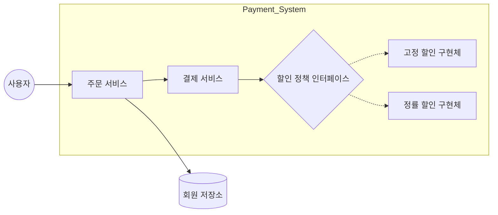

# 프로젝트 컨셉 문서: 결제 및 할인 엔진 (Payment & Discount Engine)

**Date:** 2026. 03. 17  
**Role:** Senior Backend Architect / Technical Planner

---

## = Contents =

1. Business purpose ················································································· 1
2. System context diagram ········································································· 2
3. Use case list ···························································································· 3
4. Concept of operation ··············································································· 5
5. Problem statement ·················································································· 8
6. Glossary ·································································································· 9
7. References ···························································································· 10

---

## 1. Business purpose

현대적인 이커머스 및 서비스 플랫폼에서 결제 시스템은 비즈니스의 핵심이며, 특히 '할인 정책'은 마케팅 전략에 따라 매우 빈번하게 변경되거나 확장됩니다. 본 프로젝트의 목적은 단순히 기능을 구현하는 것을 넘어, **객체지향 설계 원칙(SOLID)**을 실전 비즈니스 로직에 투영하여 유지보수성과 확장성이 극대화된 '결제 및 할인 엔진'의 표준 모델을 제시하는 데 있습니다.

핵심 목표는 다음과 같습니다:
- **유연한 정책 전환:** 비즈니스 요구사항(고정 금액 할인 vs 정률 할인) 변경 시, 서비스 로직의 수정 없이 설정을 통해 정책을 교체함.
- **결합도 최소화:** 결제 서비스(`PaymentService`)가 구체적인 할인 구현체에 의존하지 않도록 설계하여, 신규 할인 정책 추가 시 기존 코드에 미치는 영향을 제로화함.
- **객체지향의 실현:** 인터페이스와 구현체의 명확한 분리를 통해 Spring 프레임워크의 DI(Dependency Injection) 기능을 극대화하여 활용함.

---

## 2. System context diagram

시스템은 크게 회원 관리 모듈, 주문 서비스 모듈, 그리고 이번 프로젝트의 핵심인 할인 정책 모듈로 구성됩니다.

- **Member:** 등급(BASIC, VIP) 정보를 보유함.
- **PaymentService:** 할인된 최종 결제 금액을 산출함.
- **DiscountPolicy:** 모든 할인 정책의 추상 인터페이스.

---

## 3. Use case list

### 1). 회원 등급별 할인 적용
- **Actor:** 주문 서비스 (System)
- **Description:** 주문 시 회원의 등급이 VIP인 경우에만 할인 정책을 적용한다. 일반(BASIC) 등급은 할인이 적용되지 않는다.

### 2). 할인 정책의 동적 교체
- **Actor:** 관리자/AppConfig (System)
- **Description:** 시스템 운영 중 '고정 금액 할인'에서 '정률(%) 할인'으로 정책을 변경해야 할 때, 실행 시점(Runtime)에 의존성을 교체하여 적용한다.

### 3). 주문 및 결제 결과 산출
- **Actor:** 사용자
- **Description:** 사용자가 상품을 주문하면, 시스템은 [원가 - 할인 금액]을 계산하여 최종 결제 대상 금액을 반환한다.

---

## 4. Concept of operation

본 엔진은 **관심사의 분리(Separation of Concerns)**를 핵심 운영 개념으로 삼습니다.

### 1). 의존성 주입 (Dependency Injection) 통한 운영
기존 방식이 서비스 내에서 직접 `new FixDiscountPolicy()`를 호출했다면, 본 시스템은 외부 설정 객체인 `AppConfig`가 실제 구현체를 결정하고 서비스에 주입합니다.
- **이점:** 서비스 로직은 '누가' 할인을 수행하는지 알 필요 없이, '할인 기능이 존재함'만 믿고 인터페이스를 호출합니다.

### 2). OCP (Open-Closed Principle) 적용
- **Open:** 새로운 할인 정책(예: 등급별 차등 할인, 주말 특가 할인)이 필요하면 `DiscountPolicy` 인터페이스를 상속받는 신규 클래스를 만들기만 하면 됩니다.
- **Closed:** 새로운 정책이 추가되더라도 `PaymentService`나 `OrderService`의 코드는 단 한 줄도 수정되지 않습니다.

### 3). DIP (Dependency Inversion Principle) 준수
- 고수준 모듈(`PaymentService`)이 저수준 모듈(`FixDiscountPolicy`)에 의존하는 것이 아니라, 둘 다 추상화(`DiscountPolicy`)에 의존하도록 설계하여 의존 방향을 역전시킵니다.

---

## 5. Problem statement

전통적인 방식의 개발에서는 다음과 같은 치명적인 문제점들이 발생합니다:

1.  **강한 결합도(Tight Coupling):** 결제 로직 내에 특정 할인 클래스가 명시되어 있으면, 할인 방식이 바뀔 때마다 결제 로직을 다시 테스트하고 배포해야 함. 이는 회계와 직결된 결제 시스템에서 큰 리스크임.
2.  **OCP 위반:** 기능 확장 시 기존 코드를 수정해야 하므로, 버그 발생 가능성이 높고 코드 복잡도가 기하급수적으로 증가함.
3.  **테스트의 어려움:** 실제 DB나 외부 구현체에 의존하고 있어, 순수 비즈니스 로직만을 검증하는 단위 테스트(Unit Test) 작성이 까다로움.

**해결책:** Java 17의 최신 기능을 활용하고, JUnit5를 통한 목(Mock) 객체 테스트를 도입하여 각 모듈을 독립적으로 검증 가능한 구조로 전환합니다.

---

## 6. Glossary

-   **VIP:** 매출 기여도가 높아 고정 또는 정률 할인을 적용받는 회원 등급.
-   **AppConfig:** 애플리케이션의 전체 구성 정보를 담당하며, 실제 객체의 생성과 연결(DI)을 수행하는 구성 요소.
-   **DIP (Dependency Inversion Principle):** 구체화가 아닌 추상화에 의존해야 한다는 원칙.
-   **OCP (Open-Closed Principle):** 확장에는 열려 있고 수정에는 닫혀 있어야 한다는 원칙.
-   **FixDiscountPolicy:** 1,000원 등 고정된 금액을 할인해주는 정책.
-   **RateDiscountPolicy:** 주문 금액의 10% 등 비율로 할인해주는 정책.

---

## 7. References

1.  **Spring Boot Reference Documentation:** [https://spring.io/projects/spring-boot](https://spring.io/projects/spring-boot)
2.  **Clean Architecture (Robert C. Martin):** SOLID 원칙의 정수.
3.  **JUnit 5 User Guide:** [https://junit.org/junit5/docs/current/user-guide/](https://junit.org/junit5/docs/current/user-guide/)
